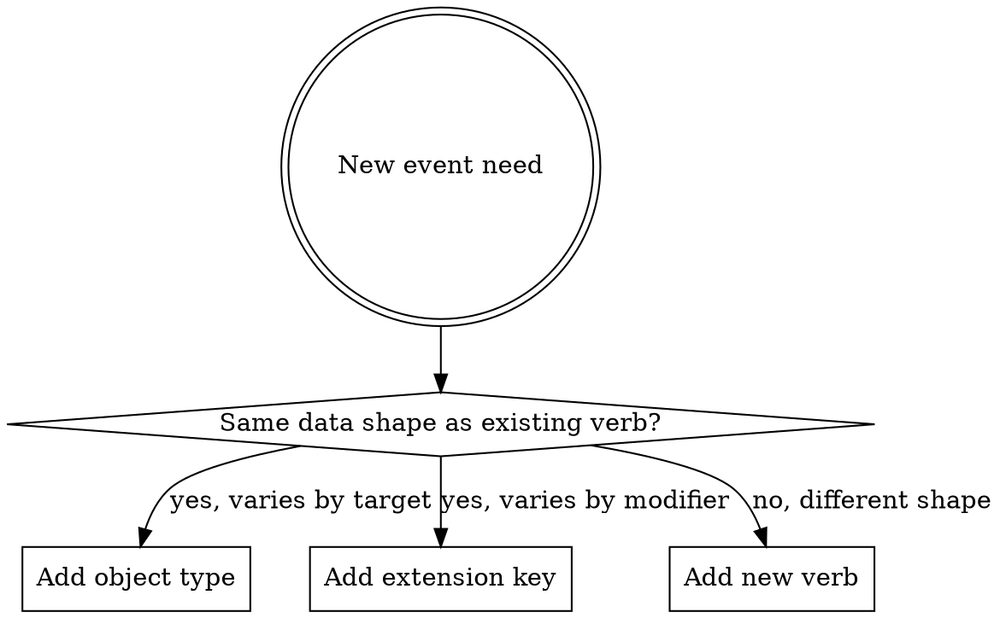

# 05e — BDM Events vocabulary (proposal)

**Status.** **DRAFT — UNDER USER REVIEW (revision 2).** Authored as a working draft so the user can refine before locking. Once validated, this becomes the authoritative vocabulary inventory; the resolutions feed into OD-19 closure and the BDM upstream change handoff. Sibling of [05a_reusable_entities.md](05a_reusable_entities.md), [05b_scoring.md](05b_scoring.md), [05c_bdm_alignment.md](05c_bdm_alignment.md), [05d_runtime.md](05d_runtime.md).

This document specifies the **events vocabulary** that our project's Schema 4a (and, by upstream extension proposal, BDM's Events spec) uses to describe what happens during a participant's interaction with a questionnaire or cognitive task. It is intended to cover **both domains** under a single coherent vocabulary, so the same downstream analytics tooling can process both.

**Revision 2 (2026-06-05) — addresses user review comments on revision 1:** `bdm:rendered` → `bdm:presented`; `bdm:captured` → `bdm:recording_started` / `bdm:recording_ended` pair; `bdm:focused` dropped; user interactions split from system events; new `bdm:clicked`, `bdm:drag_and_dropped`, `bdm:state_changed` verbs; `bdm:Item` dropped (Stimulus + Option separate); `bdm:Session` → `bdm:Activity` (BDM uses "session" for study sessions); `bdm:Page` → `bdm:Screen`; `bdm:Section` → `bdm:Panel`; `bdm:Block` dropped (carried via context only); `bdm:Input` → `bdm:UIComponent`; `bdm:Attachment` → `bdm:Recording`; units (`_ms`, `_hz`) removed from extension key names — seconds and Hz are project defaults; glossary added for CURIE, agent types, extension keys.

The document has four parts:

1. **§1 Best practices** — when to mint a new verb, polymorphic vs specific, naming conventions. Read this first; it sets the framework for the rest.
2. **§2-5 The vocabulary inventory** — verbs, object types, extension keys, with per-item specs.
3. **§6-7 Use cases** — concrete trigger walkthroughs for questionnaire and cognitive task scenarios.
4. **§8-9 Open questions + how to extend the vocabulary in the future.**

---

## 0. Glossary

These terms appear throughout the document; defined once here for reference.

| Term | Definition |
|---|---|
| **CURIE** | "Compact URI" — a notation that abbreviates a full URI using a registered prefix. `bdm:presented` is shorthand for an expanded IRI like `https://behaverse.org/data-model/vocab/presented`. The prefix-to-URI binding lives in BDM's `@context`. CURIEs make events compact and readable while preserving global uniqueness. |
| **Verb** | The CURIE identifying what kind of event occurred (e.g., `bdm:presented`, `bdm:selected`). Always past-tense; describes the event after it happened. |
| **Object type** | The CURIE identifying what entity the verb acted on (e.g., `bdm:Stimulus`, `bdm:Trial`, `bdm:Recording`). Uses PascalCase by convention (xAPI / Schema.org / ActivityStreams 2 all follow this). |
| **Extension key** | A CURIE-prefixed key used inside `result.extensions` or `context.extensions` to carry data that isn't part of the BDM Events base structure. The base structure has `agent`, `verb`, `object`, `result`, `context`, `version`, `timestamp`, `stored`, `updated`, `authority`, `attachments` — any other data the event needs goes into an extensions block under a CURIE-prefixed key. |
| **Agent** | The actor performing or experiencing the event. The BDM base structure's `agent` field. Agent types are enumerated in §3.1. |
| **Activity** | A single runtime instance of an instrument administration. What earlier drafts called a "session" — renamed to align with BDM's terminology (BDM uses *session* for a study session, i.e., one of potentially many visits in a longitudinal study). One Activity ≈ one Schema 6 record. |
| **Trial** | One participant-administered unit within an Activity. In questionnaires: typically one item (Question + Option). In cognitive tasks: one trial (e.g., one stimulus presentation + response). One Schema 5 Response row per trial. |
| **Stimulus** | The displayed or audible thing the participant perceives. For questionnaires: the Prompt (and optional Context / Instruction) shown on screen. For cognitive tasks: any letter / image / sound / video the trial includes. A single trial may include multiple Stimuli. |
| **Recording** | A continuous-data capture (mouse, keyboard, future webcam / microphone). Lives outside the event stream as a separate file referenced from `bdm:recording_started` and `bdm:recording_ended` events. Detailed in §2.5. |

---

## 1. Best practices for vocabulary design

### 1.1 Polymorphic verbs vs specific verbs — the core trade-off

In xAPI / ActivityStreams 2 / Schema.org Actions, the verb is the primary semantic carrier of an event. Two design styles coexist:

**Polymorphic verbs** (one verb, many object types): one verb covers a *class* of actions; the **object type** carries the specificity.
- Example: `bdm:presented(object: Stimulus)` and `bdm:presented(object: Feedback)` use the same verb but mean different things downstream.
- Pro: small vocabulary; easier to learn; one queryable verb name per class of action; aligns with ActivityStreams 2 philosophy.
- Con: analysts scanning a log must read both verb and object; verb alone is less informative.

**Specific verbs** (one verb per distinct action): every meaningful action gets its own verb.
- Example: `bdm:clicked`, `bdm:key_pressed`, `bdm:drag_and_dropped` for different ways of interacting.
- Pro: verbs are immediately informative; filtering by verb is one operation; downstream tools can dispatch on verb without parsing object.
- Con: vocabulary grows; semantic overlap risks (e.g., is a tap a click? is a long-press a press?); requires explicit decisions about granularity.

**Neither is universally correct.** The right choice depends on whether the actions are *the same underlying event with a varying target* or *substantively different events*.

### 1.2 Decision rules

Use the following heuristics when adding a new verb:

| Question | Answer favours… |
|---|---|
| Do the actions share the same data shape in `result` / `context`? | Polymorphic (one verb, distinguish via object) |
| Do downstream tools handle them identically? | Polymorphic |
| Will analysts frequently filter by this distinction? | Specific verb |
| Does the action have its own typical trigger condition? | Specific verb |
| Is the action high-volume / high-frequency? | Specific verb (so filtering is cheap) |
| Is the action a one-off / lifecycle / rare? | Polymorphic OK |
| Does the action carry unique extension keys that don't apply to similar actions? | Specific verb |
| Is the action describing a *manner* of something else (e.g., "by clicking" vs "by keypress")? | Extension key on a more general verb; specific verb only if the manner matters semantically |

### 1.3 Worked examples from this vocabulary

- **`bdm:presented` is polymorphic** (covers Screen, Stimulus, Option, Feedback, …). Reason: presentation is fundamentally the same act regardless of what's presented — something became perceivable by the participant at a moment in time (visually rendered, audibly played, or otherwise made available to the senses). The verb name *presented* (rather than *rendered*) is deliberate so it covers audio and other non-visual modalities. The object type carries the specificity. Filtering by object type is a clean common case.

- **`bdm:selected` / `bdm:deselected` / `bdm:changed` / `bdm:clicked` / `bdm:key_pressed` / `bdm:drag_and_dropped` are specific.** Reason: each captures a substantively different interaction with different data implications. They are all *user-initiated* events (caused by the participant's input action). Filtering by these is common in dwell-on-input analyses.

- **`bdm:trial_ended` is specific AND software-generated**, not user-initiated. The trial closes because the software decided it should — the participant clicked a Next button (where the click is `bdm:clicked`, and the trial-end is the system's reaction), or a timer expired, or auto-advance fired. The Schema 5 Response row becomes stable at this moment. Filed under §2.4 "System events" rather than user interactions.

- **`bdm:state_changed` is polymorphic** for internal state changes not tied to a visual or auditory presentation: an internal timer started or expired; a scoring threshold was crossed; a Scorer was invoked; the locale was switched programmatically. The object type carries the kind of state changed.

#### Note on `bdm:trial_started`

A separate `bdm:trial_started` verb is **not currently included** in the vocabulary. The trial start is established by the first `bdm:presented(object: Stimulus)` of the trial, and `bdm:trial_ended` carries the full trial summary including its start timestamp. If the implementation later shows a need for an explicit trial-start system event (e.g., to mark a trial whose first stimulus delivery is delayed by network or timer setup), we can add it — flagged in §8 as an open question.

### 1.4 Naming conventions

- **Past tense.** xAPI convention. `bdm:selected`, not `bdm:select`. Aligns with the "this happened" framing of an event log.
- **Lowercase, snake_case for multi-word.** Single-word preferred (`bdm:selected`, `bdm:presented`, `bdm:clicked`). Multi-word uses snake_case: `bdm:trial_ended`, `bdm:key_pressed`, `bdm:drag_and_dropped`, `bdm:recording_started`. Never camelCase.
- **Object types use PascalCase.** `bdm:Stimulus`, `bdm:Trial`, `bdm:Recording`. Matches Schema.org / xAPI conventions; the case distinction also visually separates verbs (lowercase) from object types (PascalCase) when scanning event JSON.
- **Avoid noun-as-verb.** `bdm:feedback` is a noun; prefer the verb that describes what happened (`bdm:presented` with object Feedback).
- **Avoid umbrella verbs that obscure specificity.** `bdm:interacted` was rejected for this reason. If the action set is too diverse to share a verb, split.
- **Avoid hyperbolic specificity.** A separate verb for "selected via touch" vs. "selected via mouse" is too narrow — that's `result.extensions[bdm:input_modality]`, not a verb.
- **Default units are project-wide; not embedded in names.** Times in seconds (float, full precision — *not* rounded). Frequencies in Hertz. Therefore `bdm:response_time`, not `bdm:response_time_ms`; `bdm:sample_rate`, not `bdm:sample_rate_hz`. If a key ever needs a non-default unit, the unit goes in the key name.

### 1.5 When to mint a new verb vs reuse + extension

A new verb is justified when:

- The action's `result` shape differs meaningfully from existing verbs (new mandatory or commonly-present fields).
- Downstream tools will need to dispatch on it (e.g., a dashboard query that fundamentally treats it differently from neighbours).
- It corresponds to a distinct lifecycle phase or state transition.
- Existing verbs would require a misleading interpretation (e.g., calling a sensor capture `experienced`).

Otherwise, add a new **extension key** under an existing verb. Extensions are cheap; verb-set expansion is expensive (every downstream tool has to know about it).

### 1.6 Versioning the vocabulary

The vocabulary version travels in BDM's existing `version` field on each event (the BDM CalVer that defines this vocabulary). Adding new verbs / object types / extension keys is **additive** per CalVer severity policy. Removing or repurposing existing terms is **breaking** and requires a major-deviation review.

---

## 2. Verb inventory

**19 verbs across 6 layers.** Designed to cover questionnaires and cognitive tasks under a single namespace. Verbs split into **user-initiated** (caused by participant action) and **system-initiated** (caused by software state changes).

### 2.1 Activity lifecycle — system-initiated (7 verbs)

An "Activity" is one runtime instance of an instrument administration. (See §0 Glossary for the term-choice rationale — BDM reserves "session" for study sessions.)

| Verb | Object type | When triggered |
|---|---|---|
| `bdm:initialized` | `bdm:Activity` | Activity record minted; instrument loaded; viewer ready. Participant has not yet seen anything. |
| `bdm:launched` | `bdm:Activity` | First content actually shown to the participant. Starts the experiential clock for the Activity. |
| `bdm:paused` | `bdm:Activity` | Activity suspended — page-visibility lost (tab switch), idle threshold exceeded, or explicit pause. |
| `bdm:resumed` | `bdm:Activity` | Activity continued after a pause. Carries `result.extensions[bdm:pause_duration]` (seconds, float). |
| `bdm:completed` | `bdm:Activity` | All required content done (all trials in cognitive, all required items in questionnaire). Participant may still review. Distinct from `submitted`. |
| `bdm:submitted` | `bdm:Activity` | Data left the viewer (POST to Viewer Service / Behaverse acknowledged). |
| `bdm:abandoned` | `bdm:Activity` | Activity ended without completion. Carries `result.extensions[bdm:abandon_reason]` (`timeout` / `window_closed` / `explicit_quit` / `network_loss`). |

### 2.2 Presentation — system-initiated (1 polymorphic verb)

| Verb | Object type (polymorphic) | When triggered |
|---|---|---|
| `bdm:presented` | `bdm:Screen` / `bdm:Panel` / `bdm:Stimulus` / `bdm:Option` / `bdm:Feedback` | Something became perceivable by the participant — visually rendered or audibly played. For `Stimulus`, this is *typically* the RT anchor (see §1.3 worked example and note below). For `Feedback`, carries `result.extensions[bdm:feedback_kind]` = `correctness` / `score` / `band_label` / `explanation`. |

**Note on the RT-anchor convention.** For questionnaires, the situation is simple: the prompt's `bdm:presented` is the conventional RT anchor (the participant can in principle start responding once the prompt is on screen). For cognitive tasks, a trial may include multiple Stimuli shown in various orders, and the choice of which Stimulus event serves as the RT anchor can be **task-specific** (e.g., the probe stimulus in a memory task, not the cue). The vocabulary doesn't dictate the anchor — `bdm:response_time` on `bdm:trial_ended` is computed per the instrument's own definition, documented in the Schema 2 questionnaire/task spec.

### 2.3 User interactions — user-initiated (6 verbs)

All user-interaction events are direct consequences of participant input. Each carries a timestamp (the BDM-base `timestamp` field, always populated). Computed metrics like `bdm:response_time` do **not** appear on these events; they're carried on `bdm:trial_ended` (see §2.4) because the start anchor is task-specific and computation is the software's job, not the input gesture's.

| Verb | Object type | When triggered |
|---|---|---|
| `bdm:clicked` | `bdm:Option` / `bdm:UIComponent` | Pointer click (mouse, tap, stylus). The lowest-level click event; may or may not result in a selection change. Carries the clicked target. |
| `bdm:key_pressed` | `bdm:UIComponent` / `bdm:Stimulus` | A single key event. Primarily for cognitive tasks (keypress IS the response) and for diagnostic timing in questionnaires. Carries `result.extensions[bdm:key]` (canonical name) and `result.extensions[bdm:key_code]`. |
| `bdm:selected` | `bdm:Option` / `bdm:UIComponent` | Discrete option selected — radio chosen, checkbox checked, dropdown picked. Carries `result.extensions[bdm:response_value]` = the new full selection state after this event (single value for radio; accumulated set for multi-select). |
| `bdm:deselected` | `bdm:Option` / `bdm:UIComponent` | Discrete option deselected — checkbox unchecked. Carries the new state (set after removal, or null for single-select cleared). |
| `bdm:changed` | `bdm:UIComponent` | Continuous or freeform value changed: slider drag end, numeric spinner step, text input committed (debounced ~300ms idle or focus-loss). Not for discrete selections — use `selected`/`deselected`. |
| `bdm:drag_and_dropped` | `bdm:Option` / `bdm:UIComponent` | A drag-and-drop gesture completed. Carries `result.extensions[bdm:drag_source]` and `bdm:drop_target` identifiers. |

### 2.4 System events — software-initiated (2 verbs)

| Verb | Object type | When triggered |
|---|---|---|
| `bdm:trial_ended` | `bdm:Trial` | **Trial finalised; Schema 5 Response row created.** Triggered by: software decides the trial is over (e.g., the participant's click of a Next button fires `bdm:clicked` first, then the trial closes and fires `bdm:trial_ended`); a trial timer expires; auto-advance fires; activity-submit captures all in-progress trials. Carries the canonical final `response_value` (or marks `response_skipped: true` / `timed_out: true` if no input was given), the computed `response_time` (seconds, full precision), and `correct`/`score` for trials with a Solution. `result.extensions[bdm:response_id]` ties to the Schema 5 row. Exactly one `bdm:trial_ended` per trial — including trials with no response. |
| `bdm:state_changed` | `bdm:Timer` / `bdm:Scorer` / `bdm:LocaleSwitch` / (other internal state) | A software-internal state change not tied to a visual or auditory presentation. Examples: an internal timer started or expired; a Scorer invocation began or completed; the active locale changed programmatically. Carries `result.extensions[bdm:state]` and a descriptive payload appropriate to the state kind. |

### 2.5 Recording lifecycle — system-initiated (2 verbs)

Continuous behavioural-channel captures (mouse trajectories, keyboard timing, future webcam / microphone) live **outside** the event stream as separate files (Schema 4b). The event stream tracks the recording's *lifecycle* — when it started, when it ended, where the resulting file lives — but does **not** emit one event per captured data point. The captured data file is a well-organised chunk that downstream tools open separately.

| Verb | Object type | When triggered |
|---|---|---|
| `bdm:recording_started` | `bdm:Recording` | A behavioural-channel recording opened. Carries `result.extensions[bdm:channel]` (`mouse` / `keyboard` / `webcam` / `microphone` / other) and `result.extensions[bdm:sample_rate]` (Hz, when applicable). Marks the recording's start time. |
| `bdm:recording_ended` | `bdm:Recording` | The recording closed and was stored. Carries `result.extensions[bdm:channel]`, `bdm:recording_url` (where the captured file lives), `bdm:recording_sha256` (content hash), `bdm:duration` (seconds, full precision), `bdm:sample_rate` (Hz). For long sessions chunked across multiple files, see open question §8.6. |

Detailed examples in §6.

### 2.6 Navigation — user-initiated (1 verb)

| Verb | Object type | When triggered |
|---|---|---|
| `bdm:navigated` | `bdm:Screen` (destination) | Participant moved between Screens (or between trial groupings carried in context). Carries `result.extensions[bdm:from_screen_id]` and `bdm:to_screen_id`. |

---

## 3. Object types

The PascalCase CURIE values for `event.object.objectType`. Object IRIs follow `https://behaverse.org/data-model/{object_type}/{id}`.

| CURIE | What it represents | Used by verbs |
|---|---|---|
| `bdm:Activity` | One runtime instance of an instrument administration. | All §2.1 lifecycle verbs |
| `bdm:Screen` | One screen unit (questionnaire page, cognitive instructions screen, single trial screen). Renamed from `Page` because "page" feels questionnaire-flavoured; "screen" is cross-domain. | `bdm:presented`, `bdm:navigated` |
| `bdm:Panel` | Within-screen layout grouping (typically for matrix layouts in questionnaires; could represent display panels in cognitive task UIs). Renamed from `Section` to be more visually neutral. | `bdm:presented` |
| `bdm:Stimulus` | The displayed or audible thing the participant perceives within a trial. Multiple Stimuli per trial possible (compound stimuli). | `bdm:presented`, possibly `bdm:key_pressed` (if key targets the stimulus directly rather than a UI input) |
| `bdm:Option` | A response option shown to the participant (a radio choice, a checkbox, a dropdown entry). Made first-class (rather than implicit inside an Item) because cognitive tasks and questionnaires alike present options as their own visual elements. | `bdm:presented`, `bdm:selected`, `bdm:deselected`, `bdm:clicked`, `bdm:drag_and_dropped` |
| `bdm:Trial` | The participant-administered unit. In questionnaires: typically Question + Option (one item). In cognitive tasks: one trial (stimulus presentation + response). One Schema 5 Response row per Trial. | `bdm:trial_ended` |
| `bdm:UIComponent` | An interactive UI control (radio, checkbox, slider, text field, button, key listener). Renamed from `Input` because "input" is too vague. | `bdm:clicked`, `bdm:key_pressed`, `bdm:selected`, `bdm:deselected`, `bdm:changed`, `bdm:drag_and_dropped` |
| `bdm:Feedback` | A post-response feedback display (correctness, score, band label, explanation). | `bdm:presented` |
| `bdm:Recording` | A behavioural-channel capture record. Renamed from `Attachment` because "attachment" reads like an email attachment or participant-submitted document. | `bdm:recording_started`, `bdm:recording_ended` |
| `bdm:Timer` | An internal software timer (trial-timeout countdown, idle detector, etc.). | `bdm:state_changed` |
| `bdm:Scorer` | A Scorer entity invocation (per OD-16). | `bdm:state_changed` |
| `bdm:LocaleSwitch` | A programmatic locale change. | `bdm:state_changed` |

**Note: `bdm:Block` is intentionally absent** from the object-type vocabulary. Block structure (cross-Screen wrapper in questionnaires; trial block in cognitive tasks) is carried via extension keys in `context.extensions` (`bdm:block_index`, `bdm:block_name`, `bdm:block_type`) — see §4.2 — rather than as a first-class object type. Blocks are structural metadata, not entities events act on.

### 3.1 Agent types

The `agent` field on every BDM event identifies the actor. Agent objects follow BDM's existing `{name, id, ...}` shape; their **type** distinguishes who or what initiated the event:

| Agent type CURIE | Description | Typical use |
|---|---|---|
| `bdm:Participant` | A human participant interacting with the instrument. | User-initiated events (§2.3, §2.6) |
| `bdm:Viewer` | The viewer software (Web Viewer, Native Viewer, etc.) acting on its own. | System events (§2.1, §2.2, §2.4, §2.5) where the software is the actor — timer expiry, recording started, etc. |
| `bdm:ViewerService` | The Viewer Service backend acting on its own. | Events emitted by the service (e.g., session-submission acknowledgements, forwarding confirmations). |
| `bdm:Researcher` | A researcher acting on the data (post-hoc annotation, correction, etc.). | Out of scope for participant-facing events but useful for downstream curation workflows. |

For user-initiated events, the agent is `bdm:Participant` with the participant's identifier. For system-initiated events, the agent is `bdm:Viewer` (or `bdm:ViewerService` for service-emitted events) — analysts can filter by agent type to separate "what the participant did" from "what the software did."

---

## 4. Extension keys

Extension keys are CURIE-prefixed keys used inside `result.extensions` or `context.extensions` to carry data beyond the BDM Events base structure. The base structure has `agent`, `verb`, `object`, `result`, `context`, `version`, `timestamp`, `stored`, `updated`, `authority`, `attachments`; everything else lives in extensions.

All extension keys below use the `bdm:` prefix. **Not exhaustive** — new keys are added as use cases surface; the list below is the initial inventory.

**Unit defaults (per §1.4):** times in **seconds** (float, full precision — *not* rounded); frequencies in **Hertz**. Unit suffixes are NOT in the key name for default-unit values.

### 4.1 Response-related (on `bdm:trial_ended` exclusively)

Computed and finalised values appear here, not on user-interaction events.

| Key | Type | Description |
|---|---|---|
| `bdm:response_id` | string or integer | Schema 5 Response row primary key. |
| `bdm:response_value` | any | Canonical finalised value (single value for radio / spinner / text; array for multi-select). Matches Schema 5. |
| `bdm:response_label` | string | Human-readable label for the response (e.g., the choice text "Several days"). |
| `bdm:response_description` | string | Free-form description of the response, when applicable. |
| `bdm:response_numeric` | number | Numeric encoding of the response (when applicable). |
| `bdm:response_option_index` | integer | 0-based index of the selected option (for choice items). |
| `bdm:response_time` | number (float, seconds) | Time from the task-specific RT anchor `bdm:presented(object: Stimulus)` to this `bdm:trial_ended`. Full precision; no rounding. |
| `bdm:response_skipped` | boolean | True if the trial closed with no participant input. |
| `bdm:timed_out` | boolean | True if the trial closed due to timer expiry. |
| `bdm:correct` | boolean | Per-trial correctness for Solution-bearing trials (per OD-16 16c). |
| `bdm:score` | number | Per-trial scored value (per OD-16 16a; post-reversal applied). |

These mirror the Schema 5 Response row columns. (Names should match BDM Response table column names exactly; the BDM agent should cross-check the proposed `bdm:response_label` against BDM's existing inventory — it may already exist under a different name.)

### 4.2 Trial / Block context (on most response and presentation events; in `context.extensions`)

| Key | Type | Description |
|---|---|---|
| `bdm:trial_index` | string | Trial order within the block. Matches Schema 5 column. |
| `bdm:block_index` | integer | Block (trial grouping) order. Matches Schema 5 column. |
| `bdm:block_name` | string | Block identifier (e.g., `blk_practice`). |
| `bdm:block_type` | enum | `tutorial` / `practice` / `test` / `instruction` (matches Schema 5). |
| `bdm:panel_id` | string | Within-screen panel identifier, when applicable. |
| `bdm:screen_id` | string | Screen identifier (e.g., `screen_phq9_main`). |

### 4.3 Stimulus / Option context (on presentation and interaction events)

| Key | Type | Description |
|---|---|---|
| `bdm:stimulus_id` | string | Synthetic stimulus id (per Schema 5 / OD-17f). |
| `bdm:option_id` | string | Library Option id. |

### 4.4 Activity context (on most events; in `context.extensions`)

| Key | Type | Description |
|---|---|---|
| `bdm:activity_index` | integer | 1-based ordering of the Activity per agent within the study (matches BDM Response's `activity_index`). |
| `bdm:locale` | object `{language, region?}` | Active locale at time of event. |
| `bdm:device_type` | string | `desktop` / `tablet` / `mobile` / `kiosk` / `other`. |
| `bdm:viewport` | string | e.g., `1920x1080`. |
| `bdm:input_method` | string | `mouse` / `keyboard` / `touch` / `gamepad`. |

### 4.5 Interaction-specific

| Key | Type | Description |
|---|---|---|
| `bdm:key` | string | Canonical key name on `bdm:key_pressed` (e.g., `ArrowLeft`, `Enter`). |
| `bdm:key_code` | integer | OS/browser key code. |
| `bdm:previous_value` | any | The value before this event (on `bdm:changed`, optional). |
| `bdm:change_count` | integer | How many times this input has been changed in this trial (counter). |
| `bdm:drag_source` | string | Source object id for `bdm:drag_and_dropped`. |
| `bdm:drop_target` | string | Target object id for `bdm:drag_and_dropped`. |

### 4.6 Lifecycle / navigation

| Key | Type | Description |
|---|---|---|
| `bdm:pause_duration` | number (float, seconds) | On `bdm:resumed`, how long the pause was. |
| `bdm:abandon_reason` | enum | `timeout` / `window_closed` / `explicit_quit` / `network_loss`. |
| `bdm:from_screen_id`, `bdm:to_screen_id` | string | On `bdm:navigated`. |

### 4.7 Feedback (on `bdm:presented(object: Feedback)`)

| Key | Type | Description |
|---|---|---|
| `bdm:feedback_kind` | enum | `correctness` / `score` / `band_label` / `explanation` / `generic`. |
| `bdm:feedback_target_response_id` | string or integer | The response this feedback is for. |

### 4.8 Recording (on `bdm:recording_started` and `bdm:recording_ended`)

| Key | Type | Description |
|---|---|---|
| `bdm:channel` | enum | `mouse` / `keyboard` / `webcam` / `microphone` / `other`. |
| `bdm:sample_rate` | number (Hz) | For sampled channels. On `recording_started`, declared rate; on `recording_ended`, effective rate. |
| `bdm:recording_url` | string (URI) | Where the captured file lives. On `bdm:recording_ended` only. |
| `bdm:recording_sha256` | string | Content hash. On `bdm:recording_ended` only. |
| `bdm:duration` | number (float, seconds) | Captured duration. On `bdm:recording_ended` only. |

### 4.9 State change (on `bdm:state_changed`)

| Key | Type | Description |
|---|---|---|
| `bdm:state` | string | Canonical state identifier (e.g., `started`, `expired`, `cancelled`, `completed`). |
| `bdm:state_payload` | object | Free-form payload describing what changed (object-type-specific). |

---

## 5. Event shape (BDM-Events-conformant)

Each event is a JSON object following BDM's existing Events structure (`agent`, `verb`, `object`, `result`, `context`, `version`, `timestamp`, `stored`, `updated`, `authority`, `attachments`). Our vocabulary populates `verb`, `object.objectType`, `result.extensions.*`, and `context.extensions.*` with `bdm:`-prefixed values; the structural shape itself is unchanged from BDM's spec.

**All events carry a `timestamp`** (BDM-required, RFC9557 datetime with timezone offset). Computed values like `bdm:response_time` are derived offline by the software and appear in `bdm:trial_ended` only, never on user-interaction events.

Example skeleton (`bdm:trial_ended` for a questionnaire item):

```yaml
version: "v26.MMDD"  # populated by LRS
timestamp: "2026-06-05T14:30:42.123Z"
agent:
  type: "bdm:Viewer"
  id: "behaverse-web-viewer@v26.0603"
verb: "bdm:trial_ended"
object:
  objectType: "bdm:Trial"
  id: "https://behaverse.org/data-model/Trial/trial-uuid-xyz"
result:
  extensions:
    "bdm:response_id":          5701
    "bdm:response_value":       1
    "bdm:response_label":       "Several days"
    "bdm:response_option_index":1
    "bdm:response_time":        4.197      # seconds, full precision
    "bdm:correct":              null
    "bdm:score":                1
context:
  extensions:
    "bdm:activity_index": 1
    "bdm:trial_index":    "1"
    "bdm:block_index":    1
    "bdm:block_name":     "screen_phq9_main"
    "bdm:block_type":     "test"
    "bdm:screen_id":      "screen_phq9_main"
    "bdm:locale":         { "language": "en" }
```

---

## 6. Use case walkthroughs

In the walkthroughs below, the `agent` field is omitted for brevity; user-initiated events have `agent.type = bdm:Participant`, system-initiated events have `agent.type = bdm:Viewer`.

### 6.1 Questionnaire item, single-select Likert, no feedback

```
bdm:presented   (object: bdm:Screen/screen_phq9_main)              # system
bdm:presented   (object: bdm:Stimulus/<prompt-id>)                  # system — RT anchor
bdm:presented   (object: bdm:Option/opt_phq9_freq_4)                # system
bdm:clicked     (object: bdm:UIComponent/radio_1)                   # user
bdm:selected    (object: bdm:Option/opt_phq9_freq_4, response_value=1)  # user
bdm:clicked     (object: bdm:UIComponent/next_button)               # user
bdm:trial_ended (object: bdm:Trial/<trial-id>, response_value=1,
                 response_time=4.197, response_id=R)                # system
bdm:navigated   (from screen_phq9_main to screen_2)                 # user (Next caused both)
```

### 6.2 Questionnaire multi-select, accumulation

```
bdm:presented   (object: bdm:Stimulus/<prompt-id>)
bdm:selected    (object: bdm:Option/opt_A, response_value=["A"])
bdm:selected    (object: bdm:Option/opt_C, response_value=["A","C"])
bdm:selected    (object: bdm:Option/opt_B, response_value=["A","B","C"])
bdm:clicked     (object: bdm:UIComponent/next_button)
bdm:trial_ended (object: bdm:Trial/<trial-id>, response_value=["A","B","C"], response_id=R)
```

### 6.3 Questionnaire, participant changes mind

```
bdm:presented   (object: bdm:Stimulus/<prompt-id>)
bdm:selected    (object: bdm:Option/opt_1, response_value=1)
bdm:deselected  (object: bdm:Option/opt_1, response_value=null)
bdm:selected    (object: bdm:Option/opt_2, response_value=2)
bdm:trial_ended (object: bdm:Trial/<trial-id>, response_value=2, response_id=R)
```

### 6.4 Quiz item with feedback after response

```
bdm:presented   (object: bdm:Stimulus/<prompt-id>)
bdm:selected    (object: bdm:Option/opt_A, response_value="A")
bdm:trial_ended (object: bdm:Trial/<trial-id>, response_value="A", correct=true, response_id=R)
bdm:presented   (object: bdm:Feedback/feedback_1, feedback_kind="correctness")
bdm:navigated   (to next screen)
```

### 6.5 Cognitive task trial — N-back

```
bdm:presented   (object: bdm:Stimulus/letter_T)                     # RT anchor (task-specific)
bdm:key_pressed (object: bdm:UIComponent/keyboard, key="ArrowLeft") # user (timestamp is the keypress)
bdm:trial_ended (object: bdm:Trial/trial_47, response_value="ArrowLeft",
                 response_time=0.432, correct=true, response_id=R)  # system; response_time computed
```

### 6.6 Cognitive task — timed-out trial (no response)

```
bdm:presented   (object: bdm:Stimulus/letter_T)
bdm:state_changed (object: bdm:Timer/trial_timeout, state="expired") # system — internal state
bdm:trial_ended (object: bdm:Trial/trial_48, response_skipped=true, timed_out=true,
                 response_value=null, response_id=R)
```

### 6.7 Activity lifecycle with mouse recording

```
bdm:initialized       (object: bdm:Activity/<activity-id>)
bdm:presented         (object: bdm:Screen/instructions)
bdm:launched          (object: bdm:Activity/<activity-id>)
bdm:recording_started (object: bdm:Recording/<rec-id>, channel="mouse", sample_rate=30)
... (many trial events with bdm:Participant agent) ...
bdm:completed         (object: bdm:Activity/<activity-id>)
bdm:presented         (object: bdm:Feedback/activity_summary, feedback_kind="score")
bdm:recording_ended   (object: bdm:Recording/<rec-id>, channel="mouse",
                       duration=480.123, recording_url="s3://...", recording_sha256="...")
bdm:submitted         (object: bdm:Activity/<activity-id>)
```

Note the **recording lifecycle pair**: one `bdm:recording_started` at session begin, one `bdm:recording_ended` at session close, the captured data file referenced via `bdm:recording_url`. The captured data points themselves are NOT individual events — they're a well-organised chunk written to `recording_url`. Downstream tools open the file separately to access trajectory data.

### 6.8 Internal state change — locale switch mid-activity

```
bdm:state_changed (object: bdm:LocaleSwitch/<switch-id>,
                   state="changed",
                   state_payload={ "from": {"language":"en"}, "to": {"language":"pt"} })
```

This is a system event — the Viewer's locale switcher fired programmatically (perhaps in response to a `bdm:clicked` on a language selector). The state change itself is logged separately because subsequent events will carry the new `bdm:locale` in their context.

---

## 7. Relationship to Schema 5 (Response Data)

- **Schema 5 is the trial-finalised store.** One row per trial; created at the `bdm:trial_ended` moment.
- **`bdm:trial_ended` carries `bdm:response_id`** as the join key.
- **Computed fields** (`bdm:response_time`, `bdm:correct`, `bdm:score`) are on `bdm:trial_ended` only — never on user-interaction events. The interaction events carry timestamps; response_time is derived.
- **User-interaction events** (`bdm:clicked`, `bdm:selected`, `bdm:deselected`, `bdm:changed`, `bdm:key_pressed`, `bdm:drag_and_dropped`) capture **transient state**; they are **not** in Schema 5. Schema 5 has only the finalised state per trial.
- **Other verbs** (`bdm:presented`, `bdm:navigated`, lifecycle, recording, state changes) have no Schema 5 counterpart — they live purely in the event stream.

This separation honours BDM's "events as temporal trace, responses as content store" distinction.

---

## 8. Open questions for user review (revision 2)

Questions still open after revision 1 review:

1. **`bdm:trial_started` — needed?** (Carried over from revision 1.) Current proposal: no separate verb; the first `bdm:presented(object: Stimulus)` of a trial establishes the start; `bdm:trial_ended` carries the trial summary including start time. Add later if implementation experience shows a need.

2. **Pre-`initialized` events.** Examples: consent screen, instructions screen, demographic pre-screen, locale-selection screen. Three options:
   - (α) None — these are pre-Activity UI and don't generate BDM events.
   - (β) Use `bdm:presented` for the consent/instructions screen, after `bdm:initialized` (broaden when `initialized` fires — when the Activity record is minted, not when content is shown).
   - (γ) Add a verb (`bdm:consented`, `bdm:agreed`, …) for explicit consent capture. Carries audit trail.

3. **`bdm:key_pressed` placement.** Cognitive tasks fire it per keypress (potentially hundreds per session). Questionnaires rarely fire it. Universal or cognitive-task-only?

4. **`bdm:changed` granularity for text inputs.** Current recommendation: debounce to ~300ms idle and on focus-loss. Acceptable, or different granularity (per-keystroke, per-word)?

5. **Practice vs. test trials.** Two options:
   - (α) Same vocabulary; `bdm:block_type` extension distinguishes (current proposal).
   - (β) Separate verbs (e.g., `bdm:practice_trial_ended`). Doubles trial-related verbs.

6. **`bdm:recording_started` / `bdm:recording_ended` semantics for chunked uploads.** A long session may chunk the mouse channel into multiple uploads. Options:
   - (α) One `bdm:recording_started` at session begin + one `bdm:recording_ended` at session close. Multiple internal chunks rolled up; `bdm:recording_url` resolves to the concatenated record.
   - (β) One `started`/`ended` pair per chunk. Multiple pairs per session.
   - (γ) `bdm:recording_started` once + multiple `bdm:state_changed(object: bdm:Recording, state="chunk_closed")` events for chunk boundaries + one `bdm:recording_ended` at the very end.

   Current proposal leans (α) for simplicity; (γ) if chunk-boundary granularity matters.

7. **`bdm:response_label` cross-check.** §4.1 lists `bdm:response_label` among the response keys. The BDM agent should verify whether BDM's Response table column inventory already has this under a different name (e.g., `response_text`), and align — or propose adding it.

8. **System-level events (viewer-connects-to-LRS, runtime-received).** Probably out of scope for participant-facing vocabulary, but flagging.

9. **`bdm:state_changed` granularity.** The verb is general; do we need named sub-states? For example, instead of `bdm:state_changed(state="locale_switched")`, should we have a specific `bdm:locale_switched` verb? Same trade-off as elsewhere — specific verbs are more dispatchable but inflate the vocabulary. Current proposal: keep `bdm:state_changed` polymorphic with `bdm:state` extension carrying the specific state name. Promote to specific verbs only when downstream tools need to dispatch on them.

10. **`bdm:focused` — re-introduce?** Dropped in revision 2 due to ambiguity. If we want to track input-control focus events (useful for accessibility / dropout analysis), we'd need a clearer name and section assignment. Options for re-introduction:
    - (α) Don't re-introduce; if needed later, mint a specific verb at that time.
    - (β) Add `bdm:got_focus` and `bdm:lost_focus` pair, in §2.3 user interactions (since focus is participant-driven via tab key or pointer).

---

## 9. How to extend the vocabulary later

When a new use case appears, the decision flow is:



Each new addition (verb, object type, extension key) is **additive** per CalVer policy; the vocabulary CalVer bumps when the addition lands in BDM upstream.

Catalogue maintenance: keep this document up-to-date as the source of truth. Any change made in BDM upstream gets back-ported into this document (and any change made here is proposed upstream).

---

## 10. Status + next steps

- **Revision 2 authored:** 2026-06-05 — applies user review comments from revision 1.
- **Awaiting user review** on the 10 open questions in §8.
- **Once validated:** the resolutions feed into closing **OD-19** (Schema 4a authoring) and the **BDM upstream change proposal** (added to [05c_bdm_alignment.md](05c_bdm_alignment.md) as a new deviation entry covering: `bdm:` namespace, the 19-verb vocabulary, the object type inventory, the extension key catalogue).
- **Implementation status:** Schema 4a (events JSON Schema) is **not** yet authored; this vocabulary doc is its design input.
