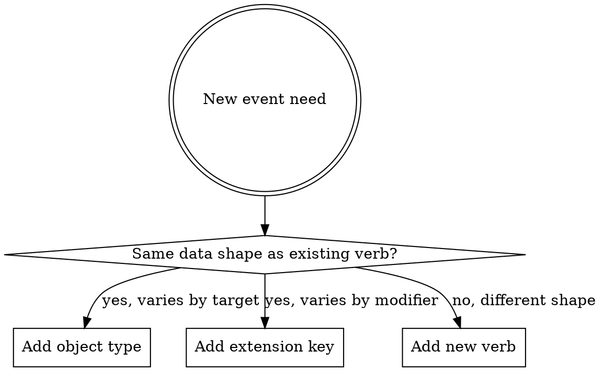

# 05e — BDM Events vocabulary (proposal)

**Status.** **DRAFT — UNDER USER REVIEW.** Authored as a working draft so the user can refine before locking. Once validated, this becomes the authoritative vocabulary inventory; the resolutions feed into OD-19 closure and the BDM upstream change handoff. Sibling of [05a_reusable_entities.md](05a_reusable_entities.md), [05b_scoring.md](05b_scoring.md), [05c_bdm_alignment.md](05c_bdm_alignment.md), [05d_runtime.md](05d_runtime.md).

This document specifies the **events vocabulary** that our project's Schema 4a (and, by upstream extension proposal, BDM's Events spec) uses to describe what happens during a participant's interaction with a questionnaire or cognitive task. It is intended to cover **both domains** under a single coherent vocabulary, so the same downstream analytics tooling can process both.

The document has four parts:

1. **§1 Best practices** — when to mint a new verb, polymorphic vs specific, naming conventions. Read this first; it sets the framework for the rest.
2. **§2-5 The vocabulary inventory** — verbs, object types, extension keys, with per-item specs.
3. **§6-7 Use cases** — concrete trigger walkthroughs for questionnaire and cognitive task scenarios.
4. **§8-9 Open questions + how to extend the vocabulary in the future.**

---

## 1. Best practices for vocabulary design

### 1.1 Polymorphic verbs vs specific verbs — the core trade-off

In xAPI / ActivityStreams / Schema.org Actions, the verb is the primary semantic carrier of an event. Two design styles coexist in the literature:

**Polymorphic verbs** (one verb, many object types): one verb covers a *class* of actions; the **object type** carries the specificity.
- Example: `bdm:rendered(object: Stimulus)` and `bdm:rendered(object: Feedback)` use the same verb but mean different things downstream.
- Pro: small vocabulary; easier to learn; one queryable verb name per class of action; aligns with ActivityStreams 2 philosophy.
- Con: analysts scanning a log must read both verb and object; verb alone is less informative.

**Specific verbs** (one verb per distinct action): every meaningful action gets its own verb.
- Example: `bdm:clicked`, `bdm:keypressed`, `bdm:dragged` for different ways of interacting.
- Pro: verbs are immediately informative; filtering by verb is one operation; downstream tools can dispatch on verb without parsing object.
- Con: vocabulary grows; semantic overlap risks (e.g., is a tap a click? is a long-press a press?); requires explicit decisions about granularity.

**Neither is universally correct.** The right choice depends on whether the actions are *the same underlying event with a varying target* or *substantively different events*.

### 1.2 Decision rules

Use the following heuristics when adding a new verb:

| Question | Answer favours… |
|---|---|
| Do the actions share the same data shape in `result` / `context`? | Polymorphic (one verb, distinguish via object) |
| Do downstream tools handle them identically? | Polymorphic |
| Will analysts frequently filter by this distinction? | Specific verb |
| Does the action have its own typical trigger condition? | Specific verb |
| Is the action high-volume / high-frequency? | Specific verb (so filtering is cheap) |
| Is the action a one-off / lifecycle / rare? | Polymorphic OK |
| Does the action carry unique extension keys that don't apply to similar actions? | Specific verb |
| Is the action describing a *manner* of something else (e.g., "by clicking" vs "by keypress")? | Extension key on a more general verb; specific verb only if the manner matters semantically |

### 1.3 Worked examples from this vocabulary

- **`bdm:rendered` is polymorphic** (covers Page, Block, Stimulus, Feedback, …). Reason: rendering is fundamentally the same act regardless of what's rendered — something appeared on screen at a moment in time. The object type carries the specificity. The data shape (timestamp, what was rendered, optional dwell time) is consistent. Filtering by object type is a clean common case.

- **`bdm:selected` / `bdm:deselected` / `bdm:changed` / `bdm:keypressed` are specific.** Reason: each captures a substantively different interaction with different data implications. `selected` carries the new selection (the canonical post-state); `keypressed` carries a key code and may not change a selection state at all; `changed` covers continuous-value updates (slider, numeric, text); `deselected` is selection's symmetric counterpart but with distinct semantics (what was removed). Filtering by these is common in dwell-on-input analyses.

- **`bdm:trial_ended` is specific** (not polymorphic with other lifecycle verbs). Reason: trial finalisation is *the* moment the Schema 5 Response row becomes stable; analysts query it constantly to find finalised trials. Hiding it under a polymorphic `bdm:lifecycle_step(stage: "trial_ended")` would punish every dashboard.

### 1.4 Naming conventions

- **Past tense.** xAPI convention. `bdm:selected`, not `bdm:select`. Aligns with the "this happened" framing of an event log.
- **Lowercase, single-word preferred.** `bdm:keypressed`, not `bdm:keyPressed` or `bdm:key_pressed`. (BDM uses `bdm:trial_ended` — multi-word with underscore — when no single past-tense form reads cleanly.)
- **Avoid noun-as-verb.** `bdm:feedback` is a noun; prefer the verb that describes what happened (`bdm:rendered` with object Feedback, or a specific verb if needed).
- **Avoid umbrella verbs that obscure specificity.** `bdm:interacted` was rejected for this reason. If the action set is too diverse to share a verb, split.
- **Avoid hyperbolic specificity.** A separate verb for "selected via touch" vs. "selected via mouse" is too narrow — that's `result.extensions[bdm:input_modality]`, not a verb.

### 1.5 When to mint a new verb vs reuse + extension

A new verb is justified when:

- The action's `result` shape differs meaningfully from existing verbs (new mandatory or commonly-present fields).
- Downstream tools will need to dispatch on it (e.g., a dashboard query that fundamentally treats it differently from neighbours).
- It corresponds to a distinct lifecycle phase or state transition.
- Existing verbs would require a misleading interpretation (e.g., calling a sensor capture `experienced`).

Otherwise, add a new **extension key** under an existing verb. Extensions are cheap; verb-set expansion is expensive (every downstream tool has to know about it).

### 1.6 Versioning the vocabulary

The vocabulary version travels in BDM's existing `version` field on each event (the BDM CalVer that defines this vocabulary). Adding new verbs / object types / extension keys is **additive** per CalVer severity policy. Removing or repurposing existing terms is **breaking** and requires a major-deviation review.

---

## 2. Verb inventory

**16 verbs across 4 layers.** Designed to cover questionnaires and cognitive tasks under a single namespace.

### 2.1 Session / instrument lifecycle (7 verbs)

| Verb | Object type | When triggered |
|---|---|---|
| `bdm:initialized` | `bdm:Session` | Session record minted; instrument loaded; viewer ready. Participant has not yet seen anything. |
| `bdm:launched` | `bdm:Session` | First content actually shown to the participant. Starts the experiential clock for the session. |
| `bdm:paused` | `bdm:Session` | Session suspended — page-visibility lost (tab switch), idle threshold exceeded, or explicit pause. |
| `bdm:resumed` | `bdm:Session` | Session continued after a pause. Carries `result.extensions[bdm:pause_duration_ms]`. |
| `bdm:completed` | `bdm:Session` | All required content done (all trials in cognitive, all required items in questionnaire). Participant may still review. Distinct from `submitted`. |
| `bdm:submitted` | `bdm:Session` | Data left the viewer (POST to Viewer Service / Behaverse acknowledged). |
| `bdm:abandoned` | `bdm:Session` | Session ended without completion. Carries `result.extensions[bdm:abandon_reason]` (timeout / window-closed / explicit-quit / network-loss). |

### 2.2 Presentation (1 polymorphic verb + 1 specific verb)

| Verb | Object type (polymorphic) | When triggered |
|---|---|---|
| `bdm:rendered` | `bdm:Page` / `bdm:Block` / `bdm:Section` / `bdm:Stimulus` / `bdm:Feedback` | Something appeared on screen for the participant. For `Stimulus`, this is the **RT anchor** — `bdm:trial_ended.result.response_time_ms` measures from the latest matching `bdm:rendered(object: Stimulus)` for the same trial. For `Feedback`, carries `result.extensions[bdm:feedback_kind]` = `correctness` / `score` / `band_label` / `explanation`. |
| `bdm:focused` | `bdm:Input/<control-id>` | An input control received focus (keyboard or pointer). Useful for accessibility and dropout-point analysis. Low information density; consider whether your deployment needs it. |

### 2.3 Response activity (5 specific verbs)

| Verb | Object type | When triggered |
|---|---|---|
| `bdm:selected` | `bdm:Item/<item-id>` or `bdm:Input/<control-id>` | Discrete option selected — radio click, checkbox check, dropdown choice. Carries `result.response_value` = the **new full selection state** after the action (for multi-select, the accumulated set; for single-select, just the new value). |
| `bdm:deselected` | same | Discrete option deselected — checkbox uncheck. Carries the new state (set after removal, or null for single-select cleared). |
| `bdm:changed` | same | Continuous or freeform value changed: slider drag end, numeric spinner step, text input committed (debounced ~300ms idle or focus-loss). Not for discrete selections — use `selected`/`deselected`. |
| `bdm:keypressed` | `bdm:Input/<control-id>` or `bdm:Stimulus/<stim-id>` | A single key event — primarily for cognitive tasks where keypress *is* the response, and for diagnostic timing in questionnaires. Carries `result.extensions[bdm:key]` (canonical name) and `result.extensions[bdm:key_code]`. May fire before or instead of `selected` depending on task semantics. |
| `bdm:trial_ended` | `bdm:Item/<item-id>` | **Trial finalised; Schema 5 Response row created.** Triggered by: participant clicks Next; trial timer expires; auto-advance fires; session-submit captures all in-progress trials. Carries the canonical final `response_value` (or marks `response_skipped: true` / `timed_out: true` if no input was given). The `result.extensions[bdm:response_id]` ties to the Schema 5 row. Exactly one `bdm:trial_ended` per trial — including trials with no response. |

### 2.4 Navigation + capture (2 verbs)

| Verb | Object type | When triggered |
|---|---|---|
| `bdm:navigated` | `bdm:Page/<to-page-id>` or `bdm:Block/<to-block-id>` | Participant moved between Pages, Blocks, or Sections. Carries `result.extensions[bdm:from_page_id]` and `bdm:to_page_id` (and similar for blocks/sections). |
| `bdm:captured` | `bdm:Attachment/<channel>` | A behavioural-channel attachment (mouse, keyboard, future webcam/microphone) was captured and stored. Carries `result.extensions[bdm:channel]`, `bdm:attachment_url`, `bdm:attachment_sha256`, `bdm:duration_ms`, `bdm:sample_rate_hz`. One per channel per session (or chunk). Renamed from the earlier draft's `bdm:recorded` to disambiguate from audio/video recording. |

---

## 3. Object types

The CURIE values for `event.object.objectType`.

| CURIE | What it represents | Used by verbs |
|---|---|---|
| `bdm:Session` | A session attempt | `bdm:initialized`, `bdm:launched`, `bdm:paused`, `bdm:resumed`, `bdm:completed`, `bdm:submitted`, `bdm:abandoned` |
| `bdm:Page` | A screen unit (questionnaire) or instruction screen (cognitive) | `bdm:rendered`, `bdm:navigated` |
| `bdm:Block` | Cross-page wrapper (questionnaire) or trial block (cognitive: practice/test) | `bdm:rendered`, `bdm:navigated` |
| `bdm:Section` | Within-page layout grouping (questionnaire only) | `bdm:rendered` |
| `bdm:Stimulus` | The presented thing the participant perceives — RT anchor | `bdm:rendered`, possibly `bdm:keypressed` (if key targets stimulus rather than input) |
| `bdm:Item` | Participant-administered unit. Questionnaires: Question + Option. Cognitive: a full trial unit (stimulus + response). | `bdm:selected`, `bdm:deselected`, `bdm:changed`, `bdm:trial_ended` |
| `bdm:Input` | An input control (radio, checkbox, slider, text field, key listener) | `bdm:focused`, `bdm:selected`, `bdm:deselected`, `bdm:changed`, `bdm:keypressed` |
| `bdm:Feedback` | A post-response feedback display | `bdm:rendered` |
| `bdm:Attachment` | A behavioural-channel attachment record | `bdm:captured` |

**Object IRI pattern** (per existing 05_data_model.md):
`https://behaverse.org/data-model/{object_type}/{id}` — e.g., `https://behaverse.org/data-model/Item/it_phq9_1`.

---

## 4. Extension keys

All under the `bdm:` prefix. Used in `result.extensions` or `context.extensions`. **Not exhaustive** — new keys are added as use cases surface; the list below is the initial inventory.

### 4.1 Response-related (on `bdm:trial_ended`, `bdm:selected`, `bdm:deselected`, `bdm:changed`)

| Key | Type | Description |
|---|---|---|
| `bdm:response_id` | string or integer | Schema 5 Response row primary key. Present on `bdm:trial_ended`. |
| `bdm:response_value` | any | Canonical final-state value (single value for radio / spinner / text; array for multi-select). On `bdm:trial_ended`, this matches Schema 5. On `bdm:selected` etc., this is the *current state after the event*, not necessarily final. |
| `bdm:response_time_ms` | number | Time from latest matching `bdm:rendered(object: Stimulus)` to this event. |
| `bdm:response_skipped` | boolean | True if `bdm:trial_ended` closed with no participant input. |
| `bdm:timed_out` | boolean | True if `bdm:trial_ended` closed due to timer expiry. |

### 4.2 Trial / item context (on most response and rendering events)

| Key | Type | Description |
|---|---|---|
| `bdm:trial_index` | string | Trial order within the block. Matches Schema 5 column. |
| `bdm:block_index` | integer | Page (questionnaire) or trial-block (cognitive) order. Matches Schema 5 column. |
| `bdm:block_name` | string | Page id or block id (e.g., `page_phq9_main`, `blk_practice`). |
| `bdm:block_type` | enum | `tutorial` / `practice` / `test` / `instruction` (matches Schema 5). |
| `bdm:section_id` | string | Within-page section, when applicable. |

### 4.3 Stimulus / option context (on rendering and response events)

| Key | Type | Description |
|---|---|---|
| `bdm:stimulus_id` | string | Synthetic stimulus id (per Schema 5 / OD-17f). |
| `bdm:option_id` | string | Library Option id. |

### 4.4 Session context (on most events)

| Key | Type | Description |
|---|---|---|
| `bdm:session_index` | integer | 1-based session ordering per agent (matches Schema 5 / Schema 6). |
| `bdm:locale` | object `{language, region?}` | Active locale at time of event. |
| `bdm:device_type` | string | desktop / tablet / mobile / kiosk / other. |
| `bdm:viewport` | string | e.g., `1920x1080`. |
| `bdm:input_method` | string | mouse / keyboard / touch / gamepad. |

### 4.5 Interaction-specific

| Key | Type | Description |
|---|---|---|
| `bdm:key` | string | Canonical key name on `bdm:keypressed` (e.g., `ArrowLeft`, `Enter`). |
| `bdm:key_code` | integer | OS/browser key code. |
| `bdm:previous_value` | any | The value before this event (on `bdm:changed`, optional). |
| `bdm:change_count` | integer | How many times this input has been changed in this trial (counter). |
| `bdm:dwell_time_ms` | number | How long an object was rendered before the next event (on `bdm:rendered`'s teardown). |

### 4.6 Lifecycle / navigation

| Key | Type | Description |
|---|---|---|
| `bdm:pause_duration_ms` | number | On `bdm:resumed`, how long the pause was. |
| `bdm:abandon_reason` | enum | timeout / window-closed / explicit-quit / network-loss. |
| `bdm:from_page_id`, `bdm:to_page_id` | string | On `bdm:navigated`. |
| `bdm:from_block_id`, `bdm:to_block_id` | string | On `bdm:navigated`. |

### 4.7 Feedback (on `bdm:rendered(object: Feedback)`)

| Key | Type | Description |
|---|---|---|
| `bdm:feedback_kind` | enum | correctness / score / band_label / explanation / generic. |
| `bdm:feedback_target_response_id` | string or integer | The response this feedback is for. |

### 4.8 Capture / attachment (on `bdm:captured`)

| Key | Type | Description |
|---|---|---|
| `bdm:channel` | enum | mouse / keyboard / webcam / microphone / other. |
| `bdm:attachment_url` | string (URI) | Where the captured data file lives. |
| `bdm:attachment_sha256` | string | Content hash of the attachment. |
| `bdm:duration_ms` | number | Captured duration. |
| `bdm:sample_rate_hz` | number | For sampled channels. |

---

## 5. Event shape (BDM-Events-conformant)

Each event is a JSON object following BDM's existing Events structure (`agent`, `verb`, `object`, `result`, `context`, `version`, `timestamp`, `stored`, `updated`, `authority`, `attachments`). Our vocabulary populates `verb`, `object.objectType`, `result.*`, and `context.*` with `bdm:`-prefixed values; the structural shape itself is unchanged from BDM's spec.

Example skeleton (`bdm:trial_ended` for a questionnaire item):

```yaml
version: "v26.MMDD"  # populated by LRS
timestamp: "2026-06-04T14:30:42.123Z"
agent:
  id: "agent_042"
verb: "bdm:trial_ended"
object:
  objectType: "bdm:Item"
  id: "https://behaverse.org/data-model/Item/it_phq9_1"
  name: "PHQ-9 item 1"
result:
  extensions:
    "bdm:response_id":      5701
    "bdm:response_value":   1
    "bdm:response_time_ms": 4200
context:
  extensions:
    "bdm:session_index": 1
    "bdm:trial_index":   "1"
    "bdm:block_index":   1
    "bdm:block_name":    "page_phq9_main"
    "bdm:block_type":    "test"
    "bdm:locale":        { "language": "en" }
```

---

## 6. Use case walkthroughs

### 6.1 Questionnaire item, single-select Likert, no feedback

```
bdm:rendered    (object: bdm:Page/page_phq9_main)
bdm:rendered    (object: bdm:Stimulus/ctx_phq9_intro+ins_likert_4+pr_phq9_1)
bdm:focused     (object: bdm:Input/radio_1)
bdm:selected    (object: bdm:Item/it_phq9_1, response_value=1)
bdm:trial_ended (object: bdm:Item/it_phq9_1, response_value=1, response_time_ms=4200,
                 response_id=R)
bdm:navigated   (from page_phq9_main to page_2)
```

### 6.2 Questionnaire multi-select, accumulation

```
bdm:rendered    (object: bdm:Stimulus/pr_choices_1)
bdm:selected    (object: bdm:Item/it_choices_1, response_value=["A"])
bdm:selected    (object: bdm:Item/it_choices_1, response_value=["A","C"])
bdm:selected    (object: bdm:Item/it_choices_1, response_value=["A","B","C"])
bdm:trial_ended (object: bdm:Item/it_choices_1, response_value=["A","B","C"], response_id=R)
```

### 6.3 Questionnaire, participant changes mind

```
bdm:rendered    (object: bdm:Stimulus/pr_phq9_1)
bdm:selected    (object: bdm:Item/it_phq9_1, response_value=1)
bdm:deselected  (object: bdm:Item/it_phq9_1, response_value=null)
bdm:selected    (object: bdm:Item/it_phq9_1, response_value=2)
bdm:trial_ended (object: bdm:Item/it_phq9_1, response_value=2, response_id=R)
```

### 6.4 Quiz item with feedback after response

```
bdm:rendered    (object: bdm:Stimulus/q_quiz_1)
bdm:selected    (object: bdm:Item/it_quiz_1, response_value="A")
bdm:trial_ended (object: bdm:Item/it_quiz_1, response_value="A", correct=true,
                 response_id=R)
bdm:rendered    (object: bdm:Feedback/feedback_1, feedback_kind="correctness")
bdm:navigated   (to next page)
```

### 6.5 Cognitive task trial — N-back

```
bdm:rendered    (object: bdm:Stimulus/letter_T, block_type="test")
bdm:keypressed  (object: bdm:Input/keyboard, key="ArrowLeft", response_time_ms=432)
bdm:trial_ended (object: bdm:Item/trial_47, response_value="ArrowLeft", correct=true,
                 response_id=R, block_index=2, block_type="test")
```

### 6.6 Cognitive task — timed-out trial (no response)

```
bdm:rendered    (object: bdm:Stimulus/letter_T, block_type="test")
bdm:trial_ended (object: bdm:Item/trial_48, response_skipped=true, timed_out=true,
                 response_id=R, response_value=null)
```

### 6.7 Session lifecycle

```
bdm:initialized (object: bdm:Session/<session-uuid>, viewer="behaverse-web-viewer")
bdm:rendered    (object: bdm:Page/instructions)
bdm:launched    (object: bdm:Session/<session-uuid>)
... (many trial events) ...
bdm:completed   (object: bdm:Session/<session-uuid>)
bdm:rendered    (object: bdm:Feedback/session_summary, feedback_kind="score")
bdm:captured    (object: bdm:Attachment/mouse_2026-06-04_session-uuid,
                 channel="mouse", duration_ms=480000, attachment_url="s3://...")
bdm:submitted   (object: bdm:Session/<session-uuid>)
```

---

## 7. Relationship to Schema 5 (Response Data)

- **Schema 5 is the trial-finalised store.** One row per trial; created at the `bdm:trial_ended` moment.
- **`bdm:trial_ended` carries `bdm:response_id`** as the join key.
- **Commonly-queried final-state fields** are duplicated natively on `bdm:trial_ended.result.*` for streaming/dashboard ergonomics: `response_value`, `response_time_ms`, `correct`, `score`. (Per OD-19c (ii) — shared natives + reference.)
- **`bdm:interacted`-class events** (`selected`, `deselected`, `changed`, `keypressed`) capture **transient state**; they are **not** in Schema 5. Schema 5 has only the finalised state per trial.
- **Other verbs** (`rendered`, `navigated`, `focused`, lifecycle, capture) have no Schema 5 counterpart — they live purely in the event stream.

This separation honours BDM's "events as temporal trace, responses as content store" distinction.

---

## 8. Open questions for user review

Before locking the vocabulary, please review and resolve:

1. **Is `bdm:focused` worth keeping?** Pro: useful for accessibility / dropout analysis. Con: niche; low information density; many deployments don't need it. Drop, keep, or make it opt-in per deployment?

2. **Is there an event missing for events that occur *before* `bdm:initialized`?** Examples: consent screen, instructions screen, demographic pre-screen, locale selection screen. Three options:
   - (α) None — these are pre-session UI and don't generate BDM events.
   - (β) Use `bdm:rendered` for the consent/instructions screen, after `bdm:initialized` (broaden when `initialized` fires — when the session record is minted, not when content is shown).
   - (γ) Add a verb (`bdm:consented`, `bdm:agreed`, …) for explicit consent capture. Carries audit trail.

3. **`bdm:keypressed` placement.** Cognitive tasks fire it per keypress (potentially hundreds per session). Questionnaires rarely fire it. Should the verb be cognitive-task-specific, or kept in the universal vocabulary?

4. **`bdm:changed` granularity for text inputs.** A participant typing a 50-character free-text answer could fire dozens of `bdm:changed` events. Current recommendation: debounce to ~300ms idle and on focus-loss. Acceptable, or do you want a different granularity (e.g., per-keystroke, per-word, per-sentence)?

5. **Practice vs. test trials.** Cognitive tasks distinguish practice / training blocks from test blocks. Two options:
   - (α) Same vocabulary; `block_type` extension distinguishes (current proposal).
   - (β) Practice trials emit different verbs (e.g., `bdm:practiced` instead of `bdm:trial_ended`). Provides verb-level filtering but doubles many trial-related verbs.

6. **`bdm:rendered` polymorphism re-examined.** Some objects might deserve their own verb:
   - `bdm:Stimulus` → could be `bdm:presented` (the RT anchor is semantically important)
   - `bdm:Page` → could be `bdm:rendered`
   - `bdm:Feedback` → could be `bdm:gave_feedback` or stay polymorphic

   The trade-off (§1.1) leans polymorphic *if* the data shape is consistent. Currently, `bdm:rendered(object: Stimulus)` adds the RT-anchor implication. Is that enough to split it out as `bdm:presented`?

7. **`bdm:captured` semantics for chunked uploads.** A long session may chunk the mouse channel into multiple uploads. Does each chunk fire one `bdm:captured`, or only the final chunk fires (and `attachment_url` resolves to all chunks)?

8. **Verb missing for "viewer connected to LRS" / "viewer received Schema 3"?** These are pre-`initialized` system events. Probably out of scope for participant-facing vocabulary, but flagging.

---

## 9. How to extend the vocabulary later

When a new use case appears, the decision flow is:



Each new addition (verb, object type, extension key) is **additive** per CalVer policy; the vocabulary CalVer bumps when the addition lands in BDM upstream.

Catalogue maintenance: keep this document up-to-date as the source of truth. Any change made in BDM upstream gets back-ported into this document (and any change made here is proposed upstream).

---

## 10. Status + next steps

- **Draft authored:** 2026-06-04
- **Awaiting user review** on the 8 open questions in §8.
- **Once validated:** the resolutions feed into closing **OD-19** (Schema 4a authoring) and the **BDM upstream change proposal** (added to [05c_bdm_alignment.md](05c_bdm_alignment.md) as a new deviation entry).
- **Implementation status:** Schema 4a (events JSON Schema) is **not** yet authored; this vocabulary doc is its design input.
