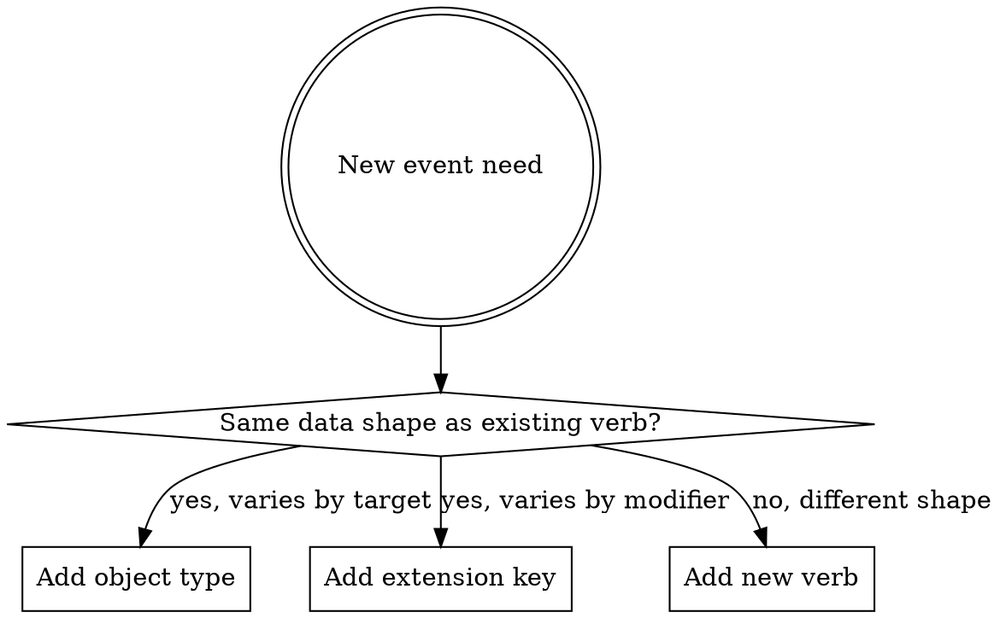

# 05e — BDM Events vocabulary (proposal)

**Status.** **DRAFT — UNDER USER REVIEW (revision 3).** Authored as a working draft so the user can refine before locking. Once validated, this becomes the authoritative vocabulary inventory; the resolutions feed into OD-19 closure and the BDM upstream change handoff. Sibling of [05a_reusable_entities.md](05a_reusable_entities.md), [05b_scoring.md](05b_scoring.md), [05c_bdm_alignment.md](05c_bdm_alignment.md), [05d_runtime.md](05d_runtime.md).

This document specifies the **events vocabulary** that our project's Schema 4a (and, by upstream extension proposal, BDM's Events spec) uses to describe what happens during an *agent's* (human participant, AI agent, etc.) interaction with a questionnaire, cognitive task, or other instrument. It is intended to cover **multiple domains** under a single coherent vocabulary, so the same downstream analytics tooling can process all of them.

**Revision 3 (2026-06-05) changes — addresses revision-2 review comments:**
- `bdm:Activity` → `bdm:RuntimeInstance` (more accurate; *Activity* now refers to the planned interaction concept, not the specific runtime execution).
- `bdm:launched` → `bdm:started` (consistent with `bdm:paused` / `bdm:resumed`).
- `bdm:trial_started` added (in §2.4 system events) — timestamp marker for trial begin.
- BDM base structure field `agent` proposed to rename → `actor` (xAPI alignment); the actor *type* `bdm:Participant` renamed → `bdm:Agent` (since "Agent" is one type of Actor in xAPI). `bdm:Viewer` → `bdm:Runtime`, `bdm:ViewerService` → `bdm:Orchestrator` (cross-domain naming).
- Response keys revised per user's authoritative definitions: `bdm:response_label` and `bdm:response_value` dropped (subsumed by `bdm:response_description` and `bdm:response_numeric` respectively).
- New context keys: `bdm:session_id` (BDM study session, set by orchestration system), `bdm:activity_id` and `bdm:activity_index` (planned interaction within a session), `bdm:runtime_id` (specific runtime instance — distinguishes restarts).
- §4 restructured: §4.2 is now "Scoping / hierarchy" (study/activity/runtime/block/trial/screen) and §4.4 is "Environment" (locale, device, hardware).
- `bdm:channel` → `bdm:source` in Recording extensions (EEG and others have many *channels*; the recording's content source is what `bdm:source` identifies).
- §5 wording corrected: not all computed values are deferred to trial-end; only `bdm:response_time` is. Removed the vague "derived offline by the software" phrasing.

The document has four parts:

1. **§1 Best practices** — when to mint a new verb, polymorphic vs specific, naming conventions. Read this first; it sets the framework for the rest.
2. **§2-5 The vocabulary inventory** — verbs, object types, extension keys, with per-item specs.
3. **§6-7 Use cases** — concrete trigger walkthroughs for questionnaire and cognitive task scenarios.
4. **§8-9 Open questions + how to extend the vocabulary in the future.**

---

## 0. Glossary

These terms appear throughout the document; defined once here for reference.

| Term | Definition |
|---|---|
| **CURIE** | "Compact URI" — a notation that abbreviates a full URI using a registered prefix. `bdm:presented` is shorthand for an expanded IRI like `https://behaverse.org/data-model/vocab/presented`. The prefix-to-URI binding lives in BDM's `@context`. CURIEs make events compact and readable while preserving global uniqueness. |
| **Verb** | The CURIE identifying what kind of event occurred (e.g., `bdm:presented`, `bdm:selected`). Always past-tense; describes the event after it happened. |
| **Object type** | The CURIE identifying what entity the verb acted on (e.g., `bdm:Stimulus`, `bdm:Trial`, `bdm:Recording`). Uses PascalCase by convention (xAPI / Schema.org / ActivityStreams 2 all follow this). |
| **Extension key** | A CURIE-prefixed key used inside `result.extensions` or `context.extensions` to carry data that isn't part of the BDM Events base structure. The base structure (see §5) carries `actor`, `verb`, `object`, `result`, `context`, `version`, `timestamp`, `stored`, `updated`, `authority`, `attachments`; everything else lives in extensions. |
| **Actor** | The entity that performed or experienced the event. The BDM Events base structure's `actor` field (proposed rename from `agent` to align with xAPI). The actor's **type** distinguishes who or what initiated the event — see §3.1. |
| **Agent** | One *type* of actor: a specific human or artificial agent (e.g., the participant, an AI agent). In xAPI / BDM terminology, `Agent` and `Group` are the two actor types — `Group` is a collection of agents. Other Behaverse-specific actor types include `Runtime` and `Orchestrator` (see §3.1). |
| **Session** | A BDM **study session** — one of potentially many visits or sittings in a longitudinal study (e.g., "during the first session, participants completed five questionnaires"). Set by the orchestration system that schedules study activities; surfaced in events via the `bdm:session_id` context key. Distinct from RuntimeInstance below. |
| **Activity** | A planned interaction with an instrument — what the participant is being asked to do (e.g., "complete the PHQ-9"). The same Activity can have multiple runtime executions if the participant restarts. Surfaced via `bdm:activity_id` / `bdm:activity_index` in context. |
| **RuntimeInstance** | One specific runtime execution of an Activity. What earlier drafts called "Session" or "Activity". Distinguishes restarts: if the same Activity is restarted twice, there are two RuntimeInstances. One RuntimeInstance ≈ one Schema 6 record. Surfaced via `bdm:runtime_id`. |
| **Trial** | One participant-administered unit within a RuntimeInstance. In questionnaires: typically one item (Question + Option). In cognitive tasks: one trial (e.g., one stimulus presentation + response). One Schema 5 Response row per Trial. |
| **Stimulus** | The displayed or audible thing the participant perceives. For questionnaires: the Prompt (and optional Context / Instruction) shown on screen. For cognitive tasks: any letter / image / sound / video the trial includes. A single trial may include multiple Stimuli. |
| **Recording** | A continuous-data capture (mouse, keyboard, EEG, future webcam / microphone). Lives outside the event stream as a separate file referenced from `bdm:recording_started` and `bdm:recording_ended` events. Detailed in §2.5. |

**Hierarchy of scoping concepts.** A useful mental model:

```
Study session (bdm:session_id, optional, set by orchestrator)
  └ Activity (bdm:activity_id / bdm:activity_index — what is planned)
      └ RuntimeInstance (bdm:runtime_id — one specific runtime execution)
          └ Block (bdm:block_index / bdm:block_name / bdm:block_type)
              └ Trial (bdm:trial_index, one Schema 5 Response row)
```

---

## 1. Best practices for vocabulary design

### 1.1 Polymorphic verbs vs specific verbs — the core trade-off

In xAPI / ActivityStreams 2 / Schema.org Actions, the verb is the primary semantic carrier of an event. Two design styles coexist:

**Polymorphic verbs** (one verb, many object types): one verb covers a *class* of actions; the **object type** carries the specificity.
- Example: `bdm:presented(object: Stimulus)` and `bdm:presented(object: Feedback)` use the same verb but mean different things downstream.
- Pro: small vocabulary; easier to learn; one queryable verb name per class of action; aligns with ActivityStreams 2 philosophy.
- Con: analysts scanning a log must read both verb and object; verb alone is less informative.

**Specific verbs** (one verb per distinct action): every meaningful action gets its own verb.
- Example: `bdm:clicked`, `bdm:key_pressed`, `bdm:drag_and_dropped` for different ways of interacting.
- Pro: verbs are immediately informative; filtering by verb is one operation; downstream tools can dispatch on verb without parsing object.
- Con: vocabulary grows; semantic overlap risks (e.g., is a tap a click? is a long-press a press?); requires explicit decisions about granularity.

**Neither is universally correct.** The right choice depends on whether the actions are *the same underlying event with a varying target* or *substantively different events*.

### 1.2 Decision rules

Use the following heuristics when adding a new verb:

| Question | Answer favours… |
|---|---|
| Do the actions share the same data shape in `result` / `context`? | Polymorphic (one verb, distinguish via object) |
| Do downstream tools handle them identically? | Polymorphic |
| Will analysts frequently filter by this distinction? | Specific verb |
| Does the action have its own typical trigger condition? | Specific verb |
| Is the action high-volume / high-frequency? | Specific verb (so filtering is cheap) |
| Is the action a one-off / lifecycle / rare? | Polymorphic OK |
| Does the action carry unique extension keys that don't apply to similar actions? | Specific verb |
| Is the action describing a *manner* of something else (e.g., "by clicking" vs "by keypress")? | Extension key on a more general verb; specific verb only if the manner matters semantically |

### 1.3 Worked examples from this vocabulary

- **`bdm:presented` is polymorphic** (covers Screen, Stimulus, Option, Feedback, …). Reason: presentation is fundamentally the same act regardless of what's presented — something became perceivable by the participant at a moment in time (visually rendered, audibly played, or otherwise made available to the senses). The verb name *presented* (rather than *rendered*) is deliberate so it covers audio and other non-visual modalities. The object type carries the specificity. Filtering by object type is a clean common case.

- **`bdm:selected` / `bdm:deselected` / `bdm:changed` / `bdm:clicked` / `bdm:key_pressed` / `bdm:drag_and_dropped` are specific.** Reason: each captures a substantively different interaction with different data implications. They are all *agent-initiated* events (caused by the agent's input action). Filtering by these is common in dwell-on-input analyses.

- **`bdm:trial_started` and `bdm:trial_ended` are specific AND system-generated**, not agent-initiated. They mark the trial's start and end boundaries — important timestamps for analysis (`bdm:trial_started` enables clean trial-segmentation; `bdm:trial_ended` produces the Schema 5 Response row). Filed under §2.4 "System events" rather than agent interactions.

- **`bdm:state_changed` is polymorphic** for internal state changes not tied to a visual or auditory presentation: an internal timer started or expired; a scoring threshold was crossed; a Scorer was invoked; the locale was switched programmatically. The object type carries the kind of state changed.

### 1.4 Naming conventions

- **Past tense.** xAPI convention. `bdm:selected`, not `bdm:select`. Aligns with the "this happened" framing of an event log.
- **Lowercase, snake_case for multi-word.** Single-word preferred (`bdm:selected`, `bdm:presented`, `bdm:clicked`, `bdm:started`). Multi-word uses snake_case: `bdm:trial_started`, `bdm:trial_ended`, `bdm:key_pressed`, `bdm:drag_and_dropped`, `bdm:recording_started`. Never camelCase.
- **Object types use PascalCase.** `bdm:Stimulus`, `bdm:Trial`, `bdm:Recording`, `bdm:RuntimeInstance`. Matches Schema.org / xAPI conventions; the case distinction also visually separates verbs (lowercase) from object types (PascalCase) when scanning event JSON.
- **Avoid noun-as-verb.** `bdm:feedback` is a noun; prefer the verb that describes what happened (`bdm:presented` with object Feedback).
- **Avoid umbrella verbs that obscure specificity.** `bdm:interacted` was rejected for this reason. If the action set is too diverse to share a verb, split.
- **Avoid hyperbolic specificity.** A separate verb for "selected via touch" vs. "selected via mouse" is too narrow — that's `result.extensions[bdm:input_modality]`, not a verb.
- **Default units are project-wide; not embedded in names.** Times in seconds (float, full precision — *not* rounded). Frequencies in Hertz. Therefore `bdm:response_time`, not `bdm:response_time_ms`; `bdm:sample_rate`, not `bdm:sample_rate_hz`. If a key ever needs a non-default unit, the unit goes in the key name.

### 1.5 When to mint a new verb vs reuse + extension

A new verb is justified when:

- The action's `result` shape differs meaningfully from existing verbs (new mandatory or commonly-present fields).
- Downstream tools will need to dispatch on it (e.g., a dashboard query that fundamentally treats it differently from neighbours).
- It corresponds to a distinct lifecycle phase or state transition.
- Existing verbs would require a misleading interpretation (e.g., calling a sensor capture `experienced`).

Otherwise, add a new **extension key** under an existing verb. Extensions are cheap; verb-set expansion is expensive (every downstream tool has to know about it).

### 1.6 Versioning the vocabulary

The vocabulary version travels in BDM's existing `version` field on each event (the BDM CalVer that defines this vocabulary). Adding new verbs / object types / extension keys is **additive** per CalVer severity policy. Removing or repurposing existing terms is **breaking** and requires a major-deviation review.

---

## 2. Verb inventory

**20 verbs across 6 layers.** Designed to cover questionnaires, cognitive tasks, and (looking ahead) video games under a single namespace. Verbs split into **agent-initiated** (caused by participant or other agent action) and **system-initiated** (caused by software state changes).

### 2.1 RuntimeInstance lifecycle — system-initiated (7 verbs)

A "RuntimeInstance" is one specific runtime execution of an Activity. See §0 Glossary for the hierarchy (study session → activity → runtime instance → block → trial).

| Verb | Object type | When triggered |
|---|---|---|
| `bdm:initialized` | `bdm:RuntimeInstance` | RuntimeInstance record minted; instrument loaded; runtime ready. Participant has not yet seen anything. |
| `bdm:started` | `bdm:RuntimeInstance` | First content actually shown to the participant. Starts the experiential clock for the RuntimeInstance. Renamed from `bdm:launched` for consistency with `paused`/`resumed`/`ended`. |
| `bdm:paused` | `bdm:RuntimeInstance` | RuntimeInstance suspended — page-visibility lost (tab switch), idle threshold exceeded, or explicit pause. |
| `bdm:resumed` | `bdm:RuntimeInstance` | RuntimeInstance continued after a pause. Carries `result.extensions[bdm:pause_duration]` (seconds, float). |
| `bdm:completed` | `bdm:RuntimeInstance` | All required content done (all trials in cognitive, all required items in questionnaire). Participant may still review. Distinct from `submitted`. |
| `bdm:submitted` | `bdm:RuntimeInstance` | Data left the runtime (POST to Orchestrator acknowledged). |
| `bdm:abandoned` | `bdm:RuntimeInstance` | RuntimeInstance ended without completion. Carries `result.extensions[bdm:abandon_reason]` (`timeout` / `window_closed` / `explicit_quit` / `network_loss`). |

### 2.2 Presentation — system-initiated (1 polymorphic verb)

| Verb | Object type (polymorphic) | When triggered |
|---|---|---|
| `bdm:presented` | `bdm:Screen` / `bdm:Panel` / `bdm:Stimulus` / `bdm:Option` / `bdm:Feedback` | Something became perceivable by the participant — visually rendered or audibly played. For `Stimulus` and `Option`, this is *typically* the reference for response-time computation (see note below). For `Feedback`, carries `result.extensions[bdm:feedback_kind]` = `correctness` / `score` / `band_label` / `explanation`. |

**Note on the response-time anchor convention.** `bdm:response_time` (on `bdm:trial_ended`) measures seconds from the moment **responding became possible** (typically the onset of options on screen, or the prompt-onset for tasks where any input is acceptable from that point). For questionnaires, this is conventionally the prompt-presentation. For cognitive tasks, a trial may include multiple Stimuli shown in various orders, and the choice of anchor is **task-specific** (e.g., the probe stimulus in a memory task, not the cue) — documented per-instrument in Schema 2.

### 2.3 Agent interactions — agent-initiated (6 verbs)

All agent-interaction events are direct consequences of agent input (typically a human participant; potentially other agent types). Each carries a timestamp (the BDM-base `timestamp` field, always populated). Computed metrics such as `bdm:response_time` do **not** appear on these events; `response_time` is carried on `bdm:trial_ended` (see §2.4) because the start anchor is task-specific and the computation is finalised at trial end.

| Verb | Object type | When triggered |
|---|---|---|
| `bdm:clicked` | `bdm:Option` / `bdm:UIComponent` | Pointer click (mouse, tap, stylus). The lowest-level click event; may or may not result in a selection change. Carries the clicked target. |
| `bdm:key_pressed` | `bdm:UIComponent` / `bdm:Stimulus` | A single key event. Primarily for cognitive tasks (keypress IS the response) and for diagnostic timing in questionnaires. Carries `result.extensions[bdm:key]` (canonical name) and `result.extensions[bdm:key_code]`. |
| `bdm:selected` | `bdm:Option` / `bdm:UIComponent` | Discrete option selected — radio chosen, checkbox checked, dropdown picked. Carries object reference to the selected option. The full multi-select state is reconstructable from the selected/deselected event sequence; not duplicated on the event. |
| `bdm:deselected` | `bdm:Option` / `bdm:UIComponent` | Discrete option deselected — checkbox unchecked. Carries the deselected option's reference. |
| `bdm:changed` | `bdm:UIComponent` | Continuous or freeform value changed: slider drag end, numeric spinner step, text input committed (debounced ~300ms idle or focus-loss). Not for discrete selections — use `selected`/`deselected`. Carries `result.extensions[bdm:current_value]`. |
| `bdm:drag_and_dropped` | `bdm:Option` / `bdm:UIComponent` | A drag-and-drop gesture completed. Carries `result.extensions[bdm:drag_source]` and `bdm:drop_target` identifiers. |

### 2.4 System events — software-initiated (3 verbs)

| Verb | Object type | When triggered |
|---|---|---|
| `bdm:trial_started` | `bdm:Trial` | A trial began. Marks the trial boundary; fires before the trial's first `bdm:presented(object: Stimulus)`. Carries `result.extensions[bdm:trial_index]` and (when applicable) `bdm:block_index` / `bdm:block_type` so analysts can identify trial boundaries without scanning forward. New in revision 3. |
| `bdm:trial_ended` | `bdm:Trial` | **Trial finalised; Schema 5 Response row created.** Triggered by: software decides the trial is over (e.g., the participant's click on a Next button fires `bdm:clicked` first, then the trial closes and fires `bdm:trial_ended`); a trial timer expires; auto-advance fires; runtime-submit captures all in-progress trials. Carries the canonical final `response_description` / `response_numeric` / `response_option_index` (or marks `response_skipped: true` / `timed_out: true` if no input was given), the computed `response_time` (seconds, full precision), and `correct` / `score` for trials with a Solution. `result.extensions[bdm:response_id]` ties to the Schema 5 row. Exactly one `bdm:trial_ended` per trial — including trials with no response. |
| `bdm:state_changed` | `bdm:Timer` / `bdm:Scorer` / `bdm:LocaleSwitch` / (other internal state) | A software-internal state change not tied to a visual or auditory presentation. Examples: an internal timer started or expired; a Scorer invocation began or completed; the active locale changed programmatically. Carries `result.extensions[bdm:state]` and a descriptive payload appropriate to the state kind. |

### 2.5 Recording lifecycle — system-initiated (2 verbs)

Continuous data captures (mouse trajectories, keyboard timing, EEG, future webcam / microphone) live **outside** the event stream as separate files (Schema 4b). The event stream tracks the recording's *lifecycle* — when it started, when it ended, where the resulting file lives — but does **not** emit one event per captured data point. The captured data file is a well-organised chunk that downstream tools open separately.

| Verb | Object type | When triggered |
|---|---|---|
| `bdm:recording_started` | `bdm:Recording` | A recording opened. Carries `result.extensions[bdm:source]` (`mouse` / `keyboard` / `eeg` / `webcam` / `microphone` / other) and `result.extensions[bdm:sample_rate]` (Hz, when applicable). Marks the recording's start time. |
| `bdm:recording_ended` | `bdm:Recording` | The recording closed and was stored. Carries `result.extensions[bdm:source]`, `bdm:recording_url` (where the captured file lives), `bdm:recording_sha256` (content hash), `bdm:duration` (seconds, full precision), `bdm:sample_rate` (Hz). For long sessions chunked across multiple files, see open question §8.6. |

Detailed examples in §6.

### 2.6 Navigation — agent-initiated (1 verb)

| Verb | Object type | When triggered |
|---|---|---|
| `bdm:navigated` | `bdm:Screen` (destination) | Participant moved between Screens (or between trial groupings carried in context). Carries `result.extensions[bdm:from_screen_id]` and `bdm:to_screen_id`. |

---

## 3. Object types

The PascalCase CURIE values for `event.object.objectType`. Object IRIs follow `https://behaverse.org/data-model/{object_type}/{id}`.

| CURIE | What it represents | Used by verbs |
|---|---|---|
| `bdm:RuntimeInstance` | One specific runtime execution of an Activity. Distinguishes restarts of the same Activity. One Schema 6 record per RuntimeInstance. | All §2.1 lifecycle verbs |
| `bdm:Screen` | One screen unit (questionnaire page, cognitive instructions screen, single trial screen). Renamed from `Page` because "page" feels questionnaire-flavoured; "screen" is cross-domain. | `bdm:presented`, `bdm:navigated` |
| `bdm:Panel` | Within-screen layout grouping (typically for matrix layouts in questionnaires; could represent display panels in cognitive task UIs). Renamed from `Section` to be more visually neutral. | `bdm:presented` |
| `bdm:Stimulus` | The displayed or audible thing the participant perceives within a trial. Multiple Stimuli per trial possible (compound stimuli). | `bdm:presented`, possibly `bdm:key_pressed` (if key targets the stimulus directly rather than a UI input) |
| `bdm:Option` | A response option shown to the participant (a radio choice, a checkbox, a dropdown entry). First-class (rather than implicit inside an Item) because cognitive tasks and questionnaires alike present options as their own visual elements. | `bdm:presented`, `bdm:selected`, `bdm:deselected`, `bdm:clicked`, `bdm:drag_and_dropped` |
| `bdm:Trial` | The participant-administered unit. In questionnaires: typically Question + Option (one item). In cognitive tasks: one trial (stimulus presentation + response). One Schema 5 Response row per Trial. | `bdm:trial_started`, `bdm:trial_ended` |
| `bdm:UIComponent` | An interactive UI control (radio, checkbox, slider, text field, button, key listener). Renamed from `Input` because "input" is too vague. | `bdm:clicked`, `bdm:key_pressed`, `bdm:selected`, `bdm:deselected`, `bdm:changed`, `bdm:drag_and_dropped` |
| `bdm:Feedback` | A post-response feedback display (correctness, score, band label, explanation). | `bdm:presented` |
| `bdm:Recording` | A continuous-data capture record. Renamed from `Attachment` because "attachment" reads like an email attachment or participant-submitted document. | `bdm:recording_started`, `bdm:recording_ended` |
| `bdm:Timer` | An internal software timer (trial-timeout countdown, idle detector, etc.). | `bdm:state_changed` |
| `bdm:Scorer` | A Scorer entity invocation (per OD-16). | `bdm:state_changed` |
| `bdm:LocaleSwitch` | A programmatic locale change. | `bdm:state_changed` |

**Note: `bdm:Block` is intentionally absent** from the object-type vocabulary. Block structure (cross-Screen wrapper in questionnaires; trial block in cognitive tasks) is carried via extension keys in `context.extensions` (`bdm:block_index`, `bdm:block_name`, `bdm:block_type`) — see §4.2 — rather than as a first-class object type. Blocks are structural metadata, not entities events act on.

### 3.1 Actor types

The `actor` field on every BDM event identifies who or what performed/experienced the event. (Note: BDM's current Events spec uses `agent` as the field name; this document proposes renaming it to `actor` to align with xAPI, where `Agent` is one *type* of actor. See deviation D5 in 05c_bdm_alignment.md.)

Actor types — the value of `actor.objectType`:

| Actor type CURIE | Description | Typical use |
|---|---|---|
| `bdm:Agent` | A specific agent — most commonly the human participant, but could be an AI agent or other automated participant. Replaces the earlier draft's `bdm:Participant`. | Agent-initiated events (§2.3, §2.6) |
| `bdm:Group` | A collection of agents acting together. xAPI vocabulary; included for compatibility. | Multi-agent studies (rare) |
| `bdm:Runtime` | The runtime software acting on its own — the client application that hosts the instrument. **Cross-domain term**: covers the Web Viewer, the Native Godot Viewer, a video-game engine, a CLI runner, etc. Renamed from `bdm:Viewer` to remove the questionnaire-flavoured framing. | System events (§2.1, §2.2, §2.4, §2.5) where the runtime software is the actor — timer expiry, recording started, presentation events, etc. |
| `bdm:Orchestrator` | The backend orchestration service acting on its own — the service that schedules Activities, mints RuntimeInstances, manages submissions and forwarding. Renamed from `bdm:ViewerService` for cross-domain neutrality. | Events emitted by the orchestrator (e.g., RuntimeInstance-submission acknowledgements, forwarding confirmations). |
| `bdm:Researcher` | A researcher acting on the data (post-hoc annotation, correction, etc.). | Out of scope for participant-facing events but useful for downstream curation workflows. |

For agent-initiated events, the actor is `bdm:Agent` with the agent's identifier. For system-initiated events, the actor is `bdm:Runtime` (or `bdm:Orchestrator` for service-emitted events) — analysts can filter by actor type to separate "what the agent did" from "what the software did."

---

## 4. Extension keys

Extension keys are CURIE-prefixed keys used inside `result.extensions` or `context.extensions` to carry data beyond the BDM Events base structure. The base structure (per BDM Events spec, see §5) has `actor`, `verb`, `object`, `result`, `context`, `version`, `timestamp`, `stored`, `updated`, `authority`, `attachments`; everything else lives in extensions.

All extension keys below use the `bdm:` prefix. **Not exhaustive** — new keys are added as use cases surface; the list below is the initial inventory.

**Unit defaults (per §1.4):** times in **seconds** (float, full precision — *not* rounded); frequencies in **Hertz**. Unit suffixes are NOT in the key name for default-unit values.

### 4.1 Response-related (on `bdm:trial_ended` exclusively)

Computed and finalised values appear here, not on agent-interaction events. Definitions match BDM Response table column semantics (cross-check with BDM agent during upstream change handoff).

| Key | Type | Description |
|---|---|---|
| `bdm:response_id` | string or integer | Schema 5 Response row primary key. |
| `bdm:response_description` | string | A short text describing the response given by the agent. For questionnaires: typically the label of a chosen option (e.g., "strongly agree"), or the text entered in a text field (open question), or a numeric input encoded as a string (e.g., "42"). |
| `bdm:response_numeric` | float | A numeric value associated with the response. In some cases empty (e.g., text inputs); in some cases the same as `response_description` (e.g., when the agent entered a number); in other cases the numeric value associated with the chosen option (e.g., the "never" option may have value 0, "always" may have value 1). **Independent of the question asked**; not a scoring code (see `score`). |
| `bdm:response_option_index` | integer | The 0-based index of the chosen option among the offered options (when offered options are a set such as `agreement_7`). Required when options are presented in random orders (e.g., a quiz). |
| `bdm:response_time` | float (seconds) | How many seconds it took the agent to enter their response, measured relative to the moment when entering a response for that trial became possible (e.g., the onset of options on screen). Full precision; no rounding. |
| `bdm:response_skipped` | boolean | True if the trial closed with no agent input. |
| `bdm:timed_out` | boolean | True if the trial closed due to timer expiry. |
| `bdm:correct` | boolean | Per-trial correctness for Solution-bearing trials (per OD-16 16c). |
| `bdm:score` | number | Per-trial scored value (per OD-16 16a; post-reversal applied). A scoring "code", distinct from `response_numeric`. |

These mirror Schema 5 Response row columns and should align with BDM Response table column names exactly (BDM agent should verify during upstream proposal).

### 4.2 Scoping / hierarchy context (on most events; in `context.extensions`)

The scoping hierarchy lets analysts filter and group events at any level (study session, activity, runtime, block, trial, screen). See §0 Glossary for the hierarchy diagram.

| Key | Type | Description |
|---|---|---|
| `bdm:session_id` | string | BDM **study session** identifier — one of potentially many visits in a longitudinal study. Set by the orchestration system that schedules study activities; may not be available in the runtime itself (depends on deployment). |
| `bdm:activity_id` | string | Identifier of the planned Activity (e.g., "complete PHQ-9"). Distinct from `runtime_id`: an Activity can have multiple RuntimeInstances if restarted. |
| `bdm:activity_index` | integer | 1-based ordering of the Activity within the study session (matches BDM Response's `activity_index`). |
| `bdm:runtime_id` | string | Identifier of the specific RuntimeInstance — the runtime-level handle that groups all events from one runtime execution. Distinguishes restarts. |
| `bdm:trial_index` | string | Trial order within the block. Matches Schema 5 column. |
| `bdm:block_index` | integer | Block (trial grouping) order. Matches Schema 5 column. |
| `bdm:block_name` | string | Block identifier (e.g., `blk_practice`). |
| `bdm:block_type` | enum | `tutorial` / `practice` / `test` / `instruction` (matches Schema 5). |
| `bdm:panel_id` | string | Within-screen panel identifier, when applicable. |
| `bdm:screen_id` | string | Screen identifier (e.g., `screen_phq9_main`). |

### 4.3 Stimulus / Option context (on presentation and interaction events)

| Key | Type | Description |
|---|---|---|
| `bdm:stimulus_id` | string | Synthetic stimulus id (per Schema 5 / OD-17f). |
| `bdm:option_id` | string | Library Option id. |

### 4.4 Environment context (on most events; in `context.extensions`)

| Key | Type | Description |
|---|---|---|
| `bdm:locale` | object `{language, region?}` | Active locale at time of event. |
| `bdm:device_type` | string | `desktop` / `tablet` / `mobile` / `kiosk` / `other`. |
| `bdm:viewport` | string | e.g., `1920x1080`. |
| `bdm:input_method` | string | `mouse` / `keyboard` / `touch` / `gamepad`. |

### 4.5 Interaction-specific

| Key | Type | Description |
|---|---|---|
| `bdm:key` | string | Canonical key name on `bdm:key_pressed` (e.g., `ArrowLeft`, `Enter`). |
| `bdm:key_code` | integer | OS/browser key code. |
| `bdm:current_value` | any | On `bdm:changed`, the value after the change (for sliders, numeric spinners, text fields). |
| `bdm:previous_value` | any | The value before this event (on `bdm:changed`, optional). |
| `bdm:change_count` | integer | How many times this input has been changed in this trial (counter). |
| `bdm:drag_source` | string | Source object id for `bdm:drag_and_dropped`. |
| `bdm:drop_target` | string | Target object id for `bdm:drag_and_dropped`. |

### 4.6 Lifecycle / navigation

| Key | Type | Description |
|---|---|---|
| `bdm:pause_duration` | float (seconds) | On `bdm:resumed`, how long the pause was. |
| `bdm:abandon_reason` | enum | `timeout` / `window_closed` / `explicit_quit` / `network_loss`. |
| `bdm:from_screen_id`, `bdm:to_screen_id` | string | On `bdm:navigated`. |

### 4.7 Feedback (on `bdm:presented(object: Feedback)`)

| Key | Type | Description |
|---|---|---|
| `bdm:feedback_kind` | enum | `correctness` / `score` / `band_label` / `explanation` / `generic`. |
| `bdm:feedback_target_response_id` | string or integer | The response this feedback is for. |

### 4.8 Recording (on `bdm:recording_started` and `bdm:recording_ended`)

| Key | Type | Description |
|---|---|---|
| `bdm:source` | enum | `mouse` / `keyboard` / `eeg` / `webcam` / `microphone` / `other`. Identifies the recording's content source. (Renamed from `channel` because EEG and similar modalities have multiple channels per recording.) |
| `bdm:sample_rate` | number (Hz) | For sampled sources. On `recording_started`, declared rate; on `recording_ended`, effective rate. |
| `bdm:recording_url` | string (URI) | Where the captured file lives. On `bdm:recording_ended` only. |
| `bdm:recording_sha256` | string | Content hash. On `bdm:recording_ended` only. |
| `bdm:duration` | float (seconds) | Captured duration. On `bdm:recording_ended` only. |

### 4.9 State change (on `bdm:state_changed`)

| Key | Type | Description |
|---|---|---|
| `bdm:state` | string | Canonical state identifier (e.g., `started`, `expired`, `cancelled`, `completed`). |
| `bdm:state_payload` | object | Free-form payload describing what changed (object-type-specific). |

---

## 5. Event shape (BDM-Events-conformant)

Each event is a JSON object following BDM's Events structure (`actor`, `verb`, `object`, `result`, `context`, `version`, `timestamp`, `stored`, `updated`, `authority`, `attachments`). Our vocabulary populates `verb`, `object.objectType`, `result.extensions.*`, and `context.extensions.*` with `bdm:`-prefixed values; the structural shape itself is unchanged from BDM's spec.

> **BDM upstream proposal D5.** BDM's current Events spec uses `agent` as the field name on each event. This document proposes renaming it to `actor` (xAPI alignment, where `Agent` is one *type* of Actor). Until BDM upstream merges this, the field name is whichever BDM currently uses; our usage emits `actor` once the rename is upstream.

**All events carry a `timestamp`** (BDM-required, RFC9557 datetime with timezone offset). `bdm:response_time` is a derived quantity computed at trial end (it must be ready when `bdm:trial_ended` is emitted) and appears only on `bdm:trial_ended` — not on agent-interaction events. Other computed values (`correct`, `score`) likewise appear on `bdm:trial_ended` for the same reason. Per-event timestamps remain on every event regardless of layer.

Example skeleton (`bdm:trial_ended` for a questionnaire item):

```yaml
version: "v26.MMDD"  # populated by LRS
timestamp: "2026-06-05T14:30:42.123Z"
actor:
  objectType: "bdm:Runtime"
  id: "behaverse-web-viewer@v26.0603"
verb: "bdm:trial_ended"
object:
  objectType: "bdm:Trial"
  id: "https://behaverse.org/data-model/Trial/trial-uuid-xyz"
result:
  extensions:
    "bdm:response_id":           5701
    "bdm:response_description":  "Several days"
    "bdm:response_numeric":      1
    "bdm:response_option_index": 1
    "bdm:response_time":         4.197   # seconds, full precision
    "bdm:correct":               null
    "bdm:score":                 1
context:
  extensions:
    "bdm:session_id":    "study_session_42"
    "bdm:activity_id":   "phq9_administration"
    "bdm:activity_index": 1
    "bdm:runtime_id":    "rt_550e8400-e29b"
    "bdm:trial_index":   "1"
    "bdm:block_index":   1
    "bdm:block_name":    "screen_phq9_main"
    "bdm:block_type":    "test"
    "bdm:screen_id":     "screen_phq9_main"
    "bdm:locale":        { "language": "en" }
```

---

## 6. Use case walkthroughs

In the walkthroughs below, the `actor` field is omitted for brevity; agent-initiated events have `actor.objectType = bdm:Agent`, system-initiated events have `actor.objectType = bdm:Runtime`.

### 6.1 Questionnaire item, single-select Likert, no feedback

```
bdm:trial_started (object: bdm:Trial/<trial-id>, trial_index="1")        # system — trial boundary
bdm:presented     (object: bdm:Screen/screen_phq9_main)                  # system
bdm:presented     (object: bdm:Stimulus/<prompt-id>)                     # system — RT anchor
bdm:presented     (object: bdm:Option/opt_phq9_freq_4)                   # system — also RT anchor
bdm:clicked       (object: bdm:UIComponent/radio_1)                      # agent
bdm:selected      (object: bdm:Option/opt_phq9_freq_4)                   # agent
bdm:clicked       (object: bdm:UIComponent/next_button)                  # agent
bdm:trial_ended   (object: bdm:Trial/<trial-id>,
                   response_description="Several days", response_numeric=1,
                   response_option_index=1, response_time=4.197, response_id=R)   # system
bdm:navigated     (from screen_phq9_main to screen_2)                    # agent
```

### 6.2 Questionnaire multi-select, accumulation

```
bdm:trial_started (object: bdm:Trial/<trial-id>, trial_index="2")
bdm:presented     (object: bdm:Stimulus/<prompt-id>)
bdm:selected      (object: bdm:Option/opt_A)
bdm:selected      (object: bdm:Option/opt_C)
bdm:selected      (object: bdm:Option/opt_B)
bdm:clicked       (object: bdm:UIComponent/next_button)
bdm:trial_ended   (object: bdm:Trial/<trial-id>,
                   response_description="[A, B, C]", response_id=R)
```

(For multi-select, the full final set is reconstructable from the selected/deselected sequence; `response_description` on `trial_ended` is the human-readable summary.)

### 6.3 Questionnaire, agent changes mind

```
bdm:trial_started (object: bdm:Trial/<trial-id>)
bdm:presented     (object: bdm:Stimulus/<prompt-id>)
bdm:selected      (object: bdm:Option/opt_1)
bdm:deselected    (object: bdm:Option/opt_1)
bdm:selected      (object: bdm:Option/opt_2)
bdm:trial_ended   (object: bdm:Trial/<trial-id>,
                   response_numeric=2, response_option_index=2, response_id=R)
```

### 6.4 Quiz item with feedback after response

```
bdm:trial_started (object: bdm:Trial/<trial-id>)
bdm:presented     (object: bdm:Stimulus/<prompt-id>)
bdm:selected      (object: bdm:Option/opt_A)
bdm:trial_ended   (object: bdm:Trial/<trial-id>,
                   response_description="A", correct=true, response_id=R)
bdm:presented     (object: bdm:Feedback/feedback_1, feedback_kind="correctness")
bdm:navigated     (to next screen)
```

### 6.5 Cognitive task trial — N-back

```
bdm:trial_started (object: bdm:Trial/trial_47, block_index=2, block_type="test")
bdm:presented     (object: bdm:Stimulus/letter_T)                          # RT anchor (task-specific)
bdm:key_pressed   (object: bdm:UIComponent/keyboard, key="ArrowLeft")      # agent (timestamp is the keypress)
bdm:trial_ended   (object: bdm:Trial/trial_47,
                   response_description="ArrowLeft", response_time=0.432,
                   correct=true, response_id=R)                            # system; response_time computed
```

### 6.6 Cognitive task — timed-out trial (no response)

```
bdm:trial_started (object: bdm:Trial/trial_48)
bdm:presented     (object: bdm:Stimulus/letter_T)
bdm:state_changed (object: bdm:Timer/trial_timeout, state="expired")       # system — internal state
bdm:trial_ended   (object: bdm:Trial/trial_48,
                   response_skipped=true, timed_out=true, response_id=R)
```

### 6.7 RuntimeInstance lifecycle with mouse recording

```
bdm:initialized       (object: bdm:RuntimeInstance/<rt-id>)
bdm:presented         (object: bdm:Screen/instructions)
bdm:started           (object: bdm:RuntimeInstance/<rt-id>)
bdm:recording_started (object: bdm:Recording/<rec-id>, source="mouse", sample_rate=30)
... (many trial events with bdm:Agent actor) ...
bdm:completed         (object: bdm:RuntimeInstance/<rt-id>)
bdm:presented         (object: bdm:Feedback/runtime_summary, feedback_kind="score")
bdm:recording_ended   (object: bdm:Recording/<rec-id>, source="mouse",
                       duration=480.123, recording_url="s3://...", recording_sha256="...")
bdm:submitted         (object: bdm:RuntimeInstance/<rt-id>)
```

Note the **recording lifecycle pair**: one `bdm:recording_started` at session begin, one `bdm:recording_ended` at session close, the captured data file referenced via `bdm:recording_url`. The captured data points themselves are NOT individual events — they're a well-organised chunk written to `recording_url`. Downstream tools open the file separately to access trajectory data.

### 6.8 Internal state change — locale switch mid-RuntimeInstance

```
bdm:state_changed (object: bdm:LocaleSwitch/<switch-id>,
                   state="changed",
                   state_payload={ "from": {"language":"en"}, "to": {"language":"pt"} })
```

This is a system event — the Runtime's locale switcher fired programmatically (perhaps in response to a `bdm:clicked` on a language selector). The state change itself is logged separately because subsequent events will carry the new `bdm:locale` in their context.

---

## 7. Relationship to Schema 5 (Response Data)

- **Schema 5 is the trial-finalised store.** One row per trial; created at the `bdm:trial_ended` moment.
- **`bdm:trial_ended` carries `bdm:response_id`** as the join key.
- **`bdm:response_time` is computed at trial end** and appears only on `bdm:trial_ended` (it requires knowledge of the response-time anchor + the finalisation moment). Other computed fields (`bdm:correct`, `bdm:score`) likewise appear on `bdm:trial_ended`.
- **Agent-interaction events** (`bdm:clicked`, `bdm:selected`, `bdm:deselected`, `bdm:changed`, `bdm:key_pressed`, `bdm:drag_and_dropped`) capture **transient input gestures**; they are **not** in Schema 5. Schema 5 has only the finalised state per trial.
- **Other verbs** (`bdm:presented`, `bdm:navigated`, lifecycle, recording, state changes) have no Schema 5 counterpart — they live purely in the event stream.

This separation honours BDM's "events as temporal trace, responses as content store" distinction.

---

## 8. Open questions for user review (revision 3)

Questions still open after revision 2 review:

1. **Pre-`initialized` events.** Examples: consent screen, instructions screen, demographic pre-screen, locale-selection screen. Three options:
   - (α) None — these are pre-RuntimeInstance UI and don't generate BDM events.
   - (β) Use `bdm:presented` for the consent/instructions screen, after `bdm:initialized` (broaden when `initialized` fires — when the RuntimeInstance record is minted, not when content is shown).
   - (γ) Add a verb (`bdm:consented`, `bdm:agreed`, …) for explicit consent capture. Carries audit trail.

2. **`bdm:key_pressed` placement.** Cognitive tasks fire it per keypress (potentially hundreds per session). Questionnaires rarely fire it. Universal or cognitive-task-only?

3. **`bdm:changed` granularity for text inputs.** Current recommendation: debounce to ~300ms idle and on focus-loss. Acceptable, or different granularity (per-keystroke, per-word)?

4. **Practice vs. test trials.** Two options:
   - (α) Same vocabulary; `bdm:block_type` extension distinguishes (current proposal).
   - (β) Separate verbs (e.g., `bdm:practice_trial_ended`). Doubles trial-related verbs.

5. **`bdm:recording_started` / `bdm:recording_ended` semantics for chunked uploads.** A long session may chunk a recording into multiple uploads. Options:
   - (α) One `bdm:recording_started` at session begin + one `bdm:recording_ended` at session close. Multiple internal chunks rolled up; `bdm:recording_url` resolves to the concatenated record.
   - (β) One `started`/`ended` pair per chunk. Multiple pairs per session.
   - (γ) `bdm:recording_started` once + multiple `bdm:state_changed(object: bdm:Recording, state="chunk_closed")` events for chunk boundaries + one `bdm:recording_ended` at the very end.

   Current proposal leans (α) for simplicity; (γ) if chunk-boundary granularity matters.

6. **Response field names cross-check.** §4.1 uses `bdm:response_description`, `bdm:response_numeric`, `bdm:response_option_index`, `bdm:response_time`. The BDM agent should confirm these match the BDM Response table column names exactly (the spec text in this document was authored from the user's definitions; BDM agent verifies against the canonical BDM schema).

7. **System-level events (runtime-connects-to-orchestrator, runtime-received-from-orchestrator).** Probably out of scope for participant-facing vocabulary, but flagging.

8. **`bdm:state_changed` granularity.** The verb is general; do we need named sub-states? For example, instead of `bdm:state_changed(state="locale_switched")`, should we have a specific `bdm:locale_switched` verb? Same trade-off as elsewhere — specific verbs are more dispatchable but inflate the vocabulary. Current proposal: keep `bdm:state_changed` polymorphic with `bdm:state` extension carrying the specific state name. Promote to specific verbs only when downstream tools need to dispatch on them.

9. **`bdm:focused` — re-introduce?** Dropped in revision 2 due to ambiguity. If we want to track input-control focus events (useful for accessibility / dropout analysis), we'd need a clearer name and section assignment. Options for re-introduction:
   - (α) Don't re-introduce; if needed later, mint a specific verb at that time.
   - (β) Add `bdm:got_focus` and `bdm:lost_focus` pair, in §2.3 agent interactions (since focus is participant-driven via tab key or pointer).

10. **`bdm:Runtime` and `bdm:Orchestrator` actor type names — final?** Revision 3 renamed from `Viewer`/`ViewerService` to these cross-domain terms. Alternative names worth considering: `Client`/`Backend`, `ClientApp`/`Service`, `Frontend`/`Server`. Current proposal sticks with `Runtime`/`Orchestrator` because they describe roles (running the instrument; orchestrating sessions) rather than positions (front/back). Comments welcome.

---

## 9. How to extend the vocabulary later

When a new use case appears, the decision flow is:



Each new addition (verb, object type, extension key) is **additive** per CalVer policy; the vocabulary CalVer bumps when the addition lands in BDM upstream.

Catalogue maintenance: keep this document up-to-date as the source of truth. Any change made in BDM upstream gets back-ported into this document (and any change made here is proposed upstream).

---

## 10. Status + next steps

- **Revision 3 authored:** 2026-06-05 — applies user review comments from revision 2.
- **Awaiting user review** on the 10 open questions in §8.
- **Once validated:** the resolutions feed into closing **OD-19** (Schema 4a authoring) and the **BDM upstream change proposal** (added to [05c_bdm_alignment.md](05c_bdm_alignment.md) as a new deviation entry covering: `bdm:` namespace, the 20-verb vocabulary, the 12-object-type inventory, the extension key catalogue, the `agent` → `actor` field rename, and the `session` / `activity` / `runtime_instance` hierarchy).
- **Implementation status:** Schema 4a (events JSON Schema) is **not** yet authored; this vocabulary doc is its design input.
