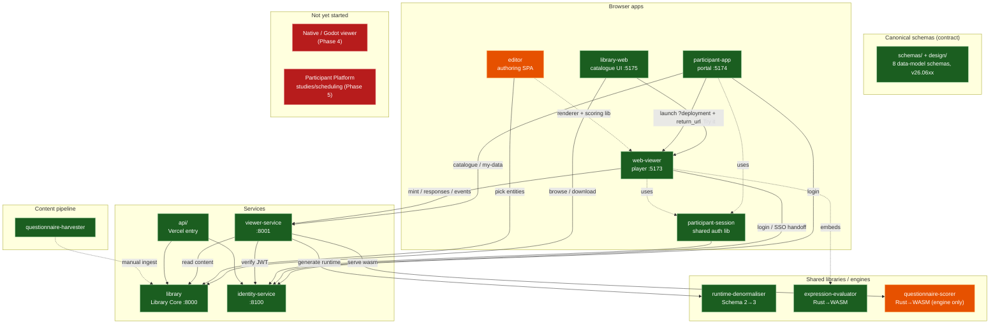

# System Overview

A snapshot of the **Behaverse questionnaire ecosystem** — what each component is, what
it does, how it connects, and where it stands. For the authoritative design see
[`../design/00_index.md`](../design/00_index.md); for sequencing see
[`../plan/01_roadmap.md`](../plan/01_roadmap.md); for the running narrative see
[`../HANDOFF.md`](../HANDOFF.md).

> **Maintenance note.** This document is a hand-maintained summary; the per-component
> details drift as work lands. When in doubt, the component READMEs, the agent memory
> index, and `HANDOFF.md` are more current. Last refreshed: **2026-06-25**.

> **🟢 LIVE (2026-06-25).** The **entire participant stack is deployed** on Vercel + Supabase
> (free tier, $0): **portal** [portal-henna-seven-32.vercel.app](https://portal-henna-seven-32.vercel.app),
> **player** [player-sooty-six.vercel.app](https://player-sooty-six.vercel.app) (⚠ **not**
> `web-viewer.vercel.app` — that alias is squatted by an unrelated "Vespucci" app; the player is
> launched _with_ a questionnaire, its bare root shows nothing),
> **Viewer Service** [viewer-service.vercel.app](https://viewer-service.vercel.app),
> **Identity** [identity-service-three.vercel.app](https://identity-service-three.vercel.app)
> (with **real email via Resend**, domain `xcit.org`). The whole pick → run → submit →
> download journey is browser-verified end-to-end. The **Library**
> ([questionnaire-library.vercel.app](https://questionnaire-library.vercel.app)) had a broken
> build (uv requirements) now fixed — its **Try-it** preview is live and acronym **search**
> is fixed (`bis` → BIS/BAS). Identity + Viewer Service share **one** Supabase DB. See
> [`../DEPLOYMENT.md`](../DEPLOYMENT.md) §0 (as-built) + `scripts/redeploy-participant-stack.sh`.
> The **editor** is now live too ([editor-static.vercel.app](https://editor-static.vercel.app),
> M2 — authoring/preview/export; auto-translate function is a follow-up gated on an AI key).
> **Everything started is now hosted.** Remaining: **M3** polish.

---

## What is this project?

A toolkit for building, hosting, deploying, running, and collecting data from
**questionnaires** (psychometric instruments, surveys, behavioural assessments). It is
organised around a set of **canonical JSON schemas** (the data-model contract) and a
handful of independently-deployable services that read and write that contract:

- a **Library** of versioned, reusable questionnaire content (live in production);
- a **Viewer Service** that turns Library content into runnable *runtimes*, manages
  deployments, mints participant sessions, and collects responses;
- **Web Viewers** (a participant **portal** + a questionnaire **player**) that run
  questionnaires in the browser;
- an **Identity** service for accounts/auth;
- an **Editor** for authoring questionnaires without writing JSON by hand;
- supporting **libraries** (a runtime denormaliser, a Rust→WASM expression evaluator, a
  Rust→WASM scorer engine) shared across viewers;
- a **Harvester** that scrapes public questionnaires into the canonical format.

The ecosystem is delivered in phases: **Phase 1 (schemas + Library)** and **Phase 2
(Viewer Service + Web Viewer + deployments)** are built; the whole **participant
experience** is built and merged; **Phase 3 (Editor)** is built but parked; **Phase 4
(Native/Godot viewer)** and **Phase 5 (Participant Platform — studies/scheduling)** are
the big remaining tracks.

---

## Component map

Colour = **development status**: 🟢 built/complete · 🟠 built-but-parked or partial ·
🔴 not started.

### Status at a glance

| Component | Role | Dev status | Deployed? |
|---|---|---|---|
| **schemas / design** | the data-model contract | 🟢 8 schemas authored & validated | in-repo (public hosting deferred) |
| **library** | Library Core read API | 🟢 complete | 🟢 **live** (Vercel + Supabase) |
| **library-web** | catalogue web UI | 🟢 complete | 🟢 **live** (Vercel) |
| **api/** | Vercel serverless entry | 🟢 thin wrapper | 🟢 **live** |
| **viewer-service** | runtime gen + deployments + sessions | 🟢 complete (VS-A..E) | 🟢 **live** ([viewer-service.vercel.app](https://viewer-service.vercel.app)) |
| **identity-service** | accounts / auth (OD-08) + Resend email | 🟢 complete (ID-A..C1) | 🟢 **live** ([identity-service-three.vercel.app](https://identity-service-three.vercel.app)) |
| **web-viewer** (player) | runs one questionnaire | 🟢 complete (WV-A..F) | 🟢 **live** ([player-sooty-six.vercel.app](https://player-sooty-six.vercel.app)) |
| **participant-app** (portal) | browse / pick / my-data | 🟢 complete (PA-1..4) | 🟢 **live** ([portal-henna-seven-32.vercel.app](https://portal-henna-seven-32.vercel.app)) |
| **participant-session** | shared auth/session lib | 🟢 complete | aliased (not published) |
| **runtime-denormaliser** | Schema 2 → Schema 3 | 🟢 complete | imported lib |
| **expression-evaluator** | OD-11 logic engine | 🟢 complete | WASM artifact |
| **questionnaire-scorer** | OD-16 scoring engine | 🟠 engine + conformance only | WASM artifact |
| **editor** | authoring SPA | 🟢 feature-complete + a11y modals | 🟢 **live** ([editor-static.vercel.app](https://editor-static.vercel.app); auto-translate via Anthropic) |
| **questionnaire-harvester** | web → canonical content | 🟢 built (content/license review ongoing) | local CLI; output ingested live |
| **Native / Godot viewer** | offline / embedded viewer | 🔴 not started (Phase 4) | — |
| **Participant Platform** | studies / scheduling | 🔴 not started (Phase 5) | — |

---

## Components

### library — Library Core

- **Description.** Read-only catalogue of questionnaires and reusable entities (canonical
  Schema 2), exposed as a versioned REST API over Git-ingested JSON in Postgres.
- **Features.** Catalogue list/detail/versions, definition fetch (resolved & unresolved),
  reusable-entity bodies, dependency graph (`dependents`), full-text search (substring/acronym
  aware) + facets, instrument-family grouping (OD-21), **`/v1/stats`** headline counts (homepage
  bar); Identity-gated **community signals** (threaded comments, 1–5 ratings, GDPR self-erasure).
  Reads are public/ungated.
- **Relationships.** Read by **library-web**, **editor**, and **viewer-service**; imports
  **identity-service** to verify tokens on write endpoints.
- **Tool stack.** Python 3.12, FastAPI, Uvicorn, Postgres (psycopg3), Pydantic,
  jsonschema, PyJWT; pytest.
- **Deployment.** Vercel serverless via `api/index.py`; backed by Supabase Postgres.
- **Location.** [`library/`](../library/)
- **Dev status.** 🟢 Complete. Phase-1 deliverable; ~38 test files.
- **Deployment status.** 🟢 **Live** — https://questionnaire-library.vercel.app (222
  questionnaires; homepage stats + Try-it preview live).
- **Todos.** ⚠️ **Filters cover only the 64 classified (survey_db) questionnaires** — the 158
  harvested ones lack `classification.{domain,population}`/instrument metadata, so Domain/
  Population/Instrument filters can't see them. *This is a harvester content task* (populate
  classification at ingest, or a one-off LLM tagging pass), **not** a Library code fix — the
  facet code is correct. Also: contribution/review lifecycle (drafts/in_review, needs Identity
  ID-C2); community signals in search ranking; per-questionnaire license badge.

### library-web — catalogue web UI

- **Description.** Public read-only catalogue SPA: search → view → download, plus a
  **"Try it"** demo link per questionnaire.
- **Features.** Browse/search/facet, detail page (metadata, items, scores, versions),
  JSON download, **"Try it"** (launches the player in render-only preview mode, no account,
  nothing stored).
- **Relationships.** Calls **library** API; **"Try it"** launches **web-viewer** with
  `?preview=<id@version>` which pulls a preview runtime from **viewer-service**.
- **Tool stack.** React 19, Vite 6, TypeScript 5.7, react-router 7, TanStack Query,
  react-markdown; Tailwind; vitest + Testing Library + Playwright e2e.
- **Deployment.** Vercel (root `vercel.json` builds this as the site frontend).
- **Location.** [`library-web/`](../library-web/) (dev port **5175**).
- **Dev status.** 🟢 Complete; ~16 test files + e2e.
- **Deployment status.** 🟢 **Live** (catalogue). The **"Try it"** preview works **locally
  only** — public Try-it needs the VS preview endpoint + a hosted player.
- **Todos.** Ship the public Try-it (hosted player + VS preview + CORS); license
  disclaimer banner for harvested content.

### api/ — Vercel serverless entry

- **Description.** Thin Vercel entrypoint that re-exports the Library FastAPI app.
- **Features.** Single-file router delegating to `library.api.app:create_app()`.
- **Relationships.** Boots **library**, which imports **identity-service** (hence root
  `requirements.txt` lists both `./library` and `./identity-service`).
- **Tool stack.** Python (minimal).
- **Deployment.** Vercel serverless function; `vercel.json` rewrites `/v1/*` and `/healthz`
  here, everything else to the SPA.
- **Location.** [`api/`](../api/)
- **Dev status.** 🟢 Pass-through wrapper.
- **Deployment status.** 🟢 **Live**.
- **Todos.** None (pass-through).

### viewer-service — Viewer Service

- **Description.** The runtime-generation spine: mints cached Schema 3 runtimes (via the
  denormaliser), manages deployments and participant sessions, collects responses, and
  forwards them to Behaverse.
- **Features.** Viewer registry (Schema 7 manifests); deployment CRUD with mode presets
  (anonymous / authenticated / invite_link / demo) + consent + redirect; session lifecycle
  (mint, resume, locale switch, completion); response collection (Schema 5 → durable
  outbox) + OD-13 forwarding worker; BDM-native CSV export (researcher + participant
  my-data); public `GET /v1/catalogue`; signed HMAC invite links; render-only **preview**
  endpoint; theme bundles (WCAG-AA checked); deployment metrics; admin runtime-cache purge.
  Control-plane is Identity-gated; the participant path is session-token-gated.
- **Relationships.** Calls **runtime-denormaliser**; reads **library** over HTTP; verifies
  **identity-service** JWTs (JWKS); serves **questionnaire-scorer** WASM; consumed by
  **web-viewer** and **participant-app**.
- **Tool stack.** Python 3.12, FastAPI, Uvicorn, Postgres (psycopg3), Pydantic, httpx,
  PyJWT, jsonschema; pytest (~199 tests).
- **Deployment.** Local-only (run alongside Library + Identity).
- **Location.** [`viewer-service/`](../viewer-service/) (dev port **8001**).
- **Dev status.** 🟢 Complete (VS-A..E).
- **Deployment status.** Local-only — **not yet hosted**; hosting it is the gate for a
  public end-to-end deployment.
- **Todos.** Deploy publicly (enables public Try-it + authenticated runs); per-record
  deployment ownership; single-use invites; ephemeral-session TTL purge; locale validation
  at deployment-create; cross-service retry/backoff to Library. See
  [`viewer-service/FOLLOWUPS.md`](../viewer-service/FOLLOWUPS.md).

### identity-service — Identity / Auth (OD-08)

- **Description.** Standalone auth service: EdDSA-JWT access tokens (verified locally via
  JWKS), opaque rotating refresh tokens, Argon2id email+password accounts, audience-scoped
  5-role RBAC. Architected to later stand alone for multiple Behaverse projects.
- **Features.** Register / login / refresh / logout / change-password; email verification +
  password reset with a config-selected mailer (SMTP or console-logs-link in dev);
  cross-origin **SSO handoff** (one-time 60 s code); `GET /v1/auth/me`; role grant/revoke;
  JWKS endpoint; a token-table **reaper** CLI (`identity reap`); migrate/generate-key/
  create-admin/create-client CLIs.
- **Relationships.** Token verifier imported by **library** and **viewer-service**; auth
  endpoints called by **participant-app** / **web-viewer** (via **participant-session**).
- **Tool stack.** Python 3.12, FastAPI, Uvicorn, Postgres (psycopg3), Pydantic, Argon2,
  PyJWT, httpx; pytest (~61 tests).
- **Deployment.** Local-only. Note: its package is installed into the **live** Library's
  serverless build (imported on boot) even though the auth *service* itself isn't hosted.
- **Location.** [`identity-service/`](../identity-service/) (dev port **8100**).
- **Dev status.** 🟢 Complete (ID-A core + ID-B gating + ID-C1 community).
- **Deployment status.** Local-only.
- **Todos.** ID-C2 contribution workflow (GitHub-PR-vs-DB-draft is an open design
  question); ID-C3 DOI minting (DataCite-blocked); ID-D editor collaboration; admin
  multi-tenant isolation; refresh-token race hardening; revoke-sessions-on-password-change.
  See [`identity-service/FOLLOWUPS.md`](../identity-service/FOLLOWUPS.md).

### web-viewer — the player

- **Description.** Custom React/TS questionnaire **player** that renders one Schema 3
  runtime in Typeform-like focus mode (one question per view). *Player only* since the
  untangle — it was the portal+runner before.
- **Features.** Session runner (anonymous / invite / authenticated); conditional logic
  (skip/branch/visibility/piping) via the WASM evaluator; in-session scoring (PHQ-9 wasm);
  resume from IndexedDB; multi-locale + switcher; consent gate + completion screens with
  optional redirect + manual **Done** return-URL; offline queue + retry; PWA; **renderer +
  scoring exported as a library** (consumed by the editor); iframe embedding via
  postMessage; render-only `?preview=` boot path.
- **Relationships.** Mints sessions / posts responses + events to **viewer-service**;
  logs in via **identity-service** (+ SSO handoff exchange on boot); embeds
  **expression-evaluator** WASM; launched by **participant-app** with
  `?deployment&return_url`; uses **participant-session**.
- **Tool stack.** React 19, Vite 6, TypeScript 5.7, react-markdown + rehype-sanitize,
  Tailwind, vite-plugin-pwa, Ajv; vitest + Testing Library + axe-core (~253 tests).
- **Deployment.** Local-only (not yet hosted).
- **Location.** [`web-viewer/`](../web-viewer/) (dev port **5173**).
- **Dev status.** 🟢 Complete (WV-A..F + scoring + participant slices).
- **Deployment status.** Local-only — hosting it (with the VS) is the public end-to-end
  deliverable.
- **Todos.** Deploy publicly; resumed sessions don't carry confirmation/redirect screen.

### participant-app — the portal

- **Description.** The participant **portal**: browse the catalogue, pick a questionnaire,
  manage your account, and see/download your own data. Launches the player and is returned
  to when the participant finishes.
- **Features.** Public catalogue browse; register (auto-login) / login / logout;
  account profile + change-password; email verification + password reset; **My data**
  (sessions + CSV download); pick→run→return with a "pick another" banner; mints an SSO
  handoff code so authenticated deployments don't re-login on the player.
- **Relationships.** Calls **viewer-service** (`/v1/catalogue`, `/v1/me/*`) and
  **identity-service** (auth); launches **web-viewer**; uses **participant-session**.
- **Tool stack.** React 19, Vite 6, TypeScript 5.7, Tailwind; vitest + Testing Library
  (~86 tests).
- **Deployment.** Local-only (not yet hosted).
- **Location.** [`participant-app/`](../participant-app/) (dev port **5174**).
- **Dev status.** 🟢 Complete (PA-1..4 + roadmap #1–#8 + SSO).
- **Deployment status.** Local-only.
- **Todos.** Turn-key `vercel.json`; deploy alongside the player + VS.

### participant-session — shared auth/session library

- **Description.** A no-build, source-aliased React library that is the single source of
  truth for participant auth: persistent login, silent refresh, logout.
- **Features.** `SessionProvider` + `useSession`; localStorage refresh token; single-flight
  silent refresh on boot + 401; an Identity client (login/refresh/logout/me/register/
  change-password/verify-email/reset); an `authFetch` Bearer wrapper.
- **Relationships.** Talks to **identity-service**; consumed by **participant-app** and
  **web-viewer** via the `@behaverse/participant-session` source alias.
- **Tool stack.** TypeScript 5.7, React 19 (peer); tests colocated in participant-app.
- **Deployment.** Not deployed independently (compiled into consumers).
- **Location.** [`participant-session/`](../participant-session/)
- **Dev status.** 🟢 Complete.
- **Deployment status.** N/A (aliased lib).
- **Todos.** httpOnly-cookie hardening (currently localStorage); standalone publish if ever
  needed.

### editor — questionnaire authoring SPA

- **Description.** Custom React/TS tool for researchers to author/edit/version/translate
  questionnaires and reusable entities visually, producing canonical Schema 2 JSON.
- **Features.** 5-concept structure tree with drag-reorder; inline WYSIWYG preview (shared
  web-viewer renderer); type-aware Option/Prompt/Context/Instruction/Message authoring;
  pick-from-Library with hard-pinned refs + newer-version upgrade (OD-06) + override/fork
  (OD-05); logic/validation/scoring builders with **live WASM** evaluation + live PHQ-9
  score preview; translation panel + machine auto-translate (serverless `/api/translate` →
  Claude); a **Library Entity Browser** (browse → inspect → edit → translate any entity);
  standalone no-backend shareable preview; bundle export.
- **Relationships.** Reads **library** (entity search + bodies); reuses **web-viewer**'s
  renderer + scoring libraries; embeds **expression-evaluator** WASM; the auto-translate
  function calls the **Claude API**.
- **Tool stack.** React 19, Vite 6, TypeScript 5.7, Zustand + Immer, dnd-kit, Ajv,
  Tailwind, lucide; vitest + Testing Library + Playwright (~430 unit + ~24 e2e).
- **Deployment.** Not deployed (a static SPA + one `/api/translate` serverless function;
  needs the translate key as an env var).
- **Location.** [`editor/`](../editor/) (dev port pinned to **5173** for live-Library CORS).
- **Dev status.** 🟠 **Feature-complete (ED-A..K + D4b) but PARKED.** The Phase-3 *gate* is
  not fully met — "reaches the Library, is reviewed, used in a deployment" needs Identity
  write-back (OD-08) + a real VS preview deployment, both blocked.
- **Deployment status.** Not deployed.
- **Todos.** Modal a11y (ForkDialog/LibraryPicker: Escape/role/focus-trap); deploy the
  editor; Identity-gated Library write-back + "Propose shared version"; real VS preview
  deploy. See [`editor/FOLLOWUPS.md`](../editor/FOLLOWUPS.md).

### runtime-denormaliser — Schema 2 → Schema 3

- **Description.** Pure Python library that turns a Schema 2 questionnaire (with refs) into
  a self-contained Schema 3 runtime: inlines references, trims to one locale, reconciles
  viewer features, pins scorer impls, optionally strips scoring, attaches provenance.
- **Features.** `denormalise()` entry point; `RuntimePolicy`; injected ref resolver;
  viewer-feature reconciliation; upfront `PreflightError` collection; optional schema
  validation. Shares a canonical hash with the VS cache.
- **Relationships.** Imported by **viewer-service** at session mint; usable by the
  **editor** for preview. Pure (no I/O).
- **Tool stack.** Python 3.12, jsonschema, referencing; pytest (56 tests).
- **Deployment.** Imported library (editable install).
- **Location.** [`questionnaire-runtime-denormaliser/`](../questionnaire-runtime-denormaliser/)
- **Dev status.** 🟢 Complete.
- **Deployment status.** Embedded in other services.
- **Todos.** Ref cycle detection; behavioural-channel reconciliation; strict-schema
  expansion.

### expression-evaluator — OD-11 logic engine

- **Description.** The cross-viewer reference implementation (Rust → WASM) of the
  questionnaire expression language: deterministic lexer → parser → evaluator. One
  canonical module embedded by every viewer + the editor.
- **Features.** Expression compile + evaluate (≤1024 chars); bindings trait (var + score
  lookups); condition evaluation (null-is-false per OD-16); value reversing; solution
  comparison (Equals/SetEquals/MatchesRegex); cross-viewer regression vectors. WASM build +
  vitest harness; host Rust tests.
- **Relationships.** Embedded in **web-viewer** (and the future Godot viewer + editor) via
  wasm-bindgen. Grammar is normative in `design/15`.
- **Tool stack.** Rust (core crate + wasm-bindgen), npm/vitest for the web package;
  `test_vectors.json`.
- **Deployment.** WASM artifact shipped with the player; Rust crate built locally.
- **Location.** [`questionnaire-expression-evaluator/`](../questionnaire-expression-evaluator/)
- **Dev status.** 🟢 Complete (24 Rust + 31 WASM tests).
- **Deployment status.** WASM ready; rides along with the player.
- **Todos.** Godot C-ABI wrapper (when the Native Viewer exists); aggregate functions;
  wasm-opt size pass; possible npm publish.

### questionnaire-scorer — OD-16 scoring engine

- **Description.** Scorer execution core + conformance runner: a Rust ABI (`scorer!`
  macro), a reference **PHQ-9** scorer (Rust → WASM), a TypeScript host
  (`compileScorer`/`runScorer`), and a conformance CLI.
- **Features.** `scorer-abi` crate; PHQ-9 reference (`dist-wasm/phq9.wasm`); TS host
  compile + execute with bindings; conformance runner/CLI for vector validation;
  reproducible builds (sha256-synced).
- **Relationships.** WASM served by **viewer-service** and reused by the **web-viewer**
  scoring engine (and editor preview); the schema validator gates Library ingestion.
- **Tool stack.** Rust (abi + phq9 crates), TypeScript host, wasm-pack, Cargo workspace;
  cargo + vitest tests.
- **Deployment.** WASM artifacts served by the VS; conformance CLI local.
- **Location.** [`questionnaire-scorer/`](../questionnaire-scorer/)
- **Dev status.** 🟠 **Sub-project 1 only** — engine + conformance + one reference scorer.
  `http`/`python`/`r` executors and more reference scorers (GAD-7, PSS-10) are not built.
- **Deployment status.** WASM ready; no live remote executors.
- **Todos.** `http`/`python`/`r` executors (SP3); more reference scorers; cross-impl
  agreement assertions; Library publish gate; possible npm publish.

### questionnaire-harvester — content pipeline

- **Description.** A CLI pipeline that scrapes public questionnaires (PsyToolkit,
  psychology-tools) into canonical Schema 2 entities with content-fingerprint dedup.
  Strictly isolated — writes only to its `output/`, never the Library DB directly.
- **Features.** Source adapters (PsyToolkit DSL, psychology-tools forms); dedup
  fingerprinting; raw → reuse-or-mint → canonical pipeline; curation stores (descriptions,
  short titles, source metadata); review/scoring artifacts; CLIs (harvest, review-export,
  document-scoring, apply-descriptions, apply-short-titles); validation via the Library
  Schema-2 validator. Manual promotion via `library ingest`.
- **Relationships.** Reads psytoolkit.org / psychology-tools.com; writes `output/`; uses
  the **library** validator; content is manually ingested into the live **library**.
- **Tool stack.** Python 3.11, BeautifulSoup4, httpx; pytest.
- **Deployment.** Local-only CLI; Git-tracked output; manual ingest.
- **Location.** [`questionnaire-harvester/`](../questionnaire-harvester/)
- **Dev status.** 🟢 Built (foundation complete; ⚠️ run by a **separate concurrent agent** —
  see project-wide notes).
- **Deployment status.** Its output is **live** — 158 of the 212 live questionnaires came
  from the harvester (most still `license: unknown`, pending review).
- **Todos.** Per-instrument domain/population extraction; fuzzy near-match dedup; more
  source adapters; structured license block + a Web-UI disclaimer banner.

### Native / Godot viewer — Phase 4 (not started)

- **Description.** A native viewer for **offline** data collection and **embedding** in
  games/VR (Godot), with feature parity to the web player. Owner has explicitly sequenced
  this **LAST**.
- **Dev status.** 🔴 Not started (only an old `qv_godot/` scaffold, now archived).
- **Todos.** Native renderer; local persistence + sync queue; kiosk mode; Godot plugin
  packaging; Godot C-ABI wrapper for the expression evaluator; cross-viewer parity suite.

### Participant Platform — Phase 5 (not started)

- **Description.** Longitudinal studies with scheduled assessments, reminders, and
  participant/researcher dashboards, built on Identity. The biggest unbuilt, non-blocked
  track. (The lightweight per-deployment participant *journey* is already built; this is
  the study/protocol/scheduling layer above it.)
- **Dev status.** 🔴 Not started.
- **Todos.** Study + protocol builder; OD-09 assignment scheduler; consent **lifecycle**
  (versioning / re-consent / withdrawal); notifications; participant + compliance
  dashboards.

---

## Project-wide concerns

- **Deployment posture (2026-06-25: participant stack LIVE).** Everything except the
  **editor** is now hosted on **Vercel + Supabase** (free tier, $0): the **Library**
  (`library-web` + `api/`), plus **Identity**, **Viewer Service**, **player**, and **portal**
  — each its own Vercel project. Identity + Viewer Service share **one** Supabase Postgres
  (`questionnaire-identity`, eu-central-1; the free tier caps an org at 2 active projects and
  their tables don't collide); the Library keeps its own. **Real email** runs via **Resend**
  (`xcit.org`). The public **"Try it"** demo is live. Mechanics that diverged from the
  original runbook (assembled-VS dir, locally-built static frontends, Vercel-API env, the
  Library `uv` requirements fix) are documented in [`../DEPLOYMENT.md`](../DEPLOYMENT.md) §0,
  with `scripts/redeploy-participant-stack.sh` for one-command redeploys. The **editor** is now
  hosted too ([editor-static.vercel.app](https://editor-static.vercel.app); its cross-origin
  Library reads required adding the editor origin to the Library's `LIBRARY_CORS_ORIGINS`). The
  editor's `/api/translate` **auto-translate function is live** (Vercel Function via `vercel build
  --prebuilt`; Anthropic `claude-sonnet-4-6`). **Every started component is now hosted.**

- **Repo topology / reorg.** The design locks a future **multi-repo** layout
  (`behaverse/questionnaire-*`), but the physical split is **deferred** — everything lives
  in this single local checkout for now. Superseded predecessors were moved to a
  gitignored top-level `archive/`. A folder reorg toward the target topology is an open
  project-wide task, not yet scheduled.

- **⚠️ Multi-agent checkout.** A separate **harvester** agent shares this same checkout and
  pushes `master` concurrently (working under `questionnaire-harvester/` + `library/`).
  Keep commits scoped; `git fetch` + ff-or-rebase before every push;
  `scripts/seed-supabase.md` is perpetually modified (stash before rebasing). `HANDOFF.md`
  and `editor/.env.local` are gitignored.

- **Operational gotchas.** Per-origin **CORS** allow-lists (`IDENTITY_CORS_ORIGINS`,
  `VS_CORS_ORIGINS`, `LIBRARY_CORS_ORIGINS`) must include every frontend port or pages
  silently fail; **test the browser request, not the API**; **don't re-import** content to
  "fill" the local Library (canonical content is on Supabase); **restart Python services
  after a merge**. Full list in [`operational-gotchas.md`](operational-gotchas.md).

- **Schema hosting.** The 8 data-model schemas live in-repo (`schemas/`); public hosting at
  `behaverse.org/schemas/` is deferred — `$id` URLs resolve locally for now.

- **Conventions.** All durations are in **seconds**; versions use **CalVer** (`vYY.MMDD`);
  the expression grammar is normative in `design/15`; the canonical format stack is "S1
  pure custom" (JSON + React web viewer + Godot native + Editor, no SurveyJS).

- **Resolved blockers.** The previously-open token-table **TTL reaper** (handoff/email/
  refresh tables growing unbounded) is now built and merged (`identity reap`).

---

## Where to go next

Three viable, non-blocking tracks (owner's standing rule: finish all components, with the
Native/Godot viewer **LAST**):

1. **Phase 5 — Participant Platform** (largest unbuilt piece: study/protocol builder,
   OD-09 scheduler, consent lifecycle, notifications, dashboards).
2. **Public full-stack deployment** (host VS + player + portal → unlocks public "Try it"
   and authenticated runs).
3. **Unblock the Editor** (Identity-gated Library write-back + real VS preview → closes the
   Phase-3 gate).

See [`../HANDOFF.md`](../HANDOFF.md) and [`../plan/01_roadmap.md`](../plan/01_roadmap.md)
for the full sequencing rationale.
