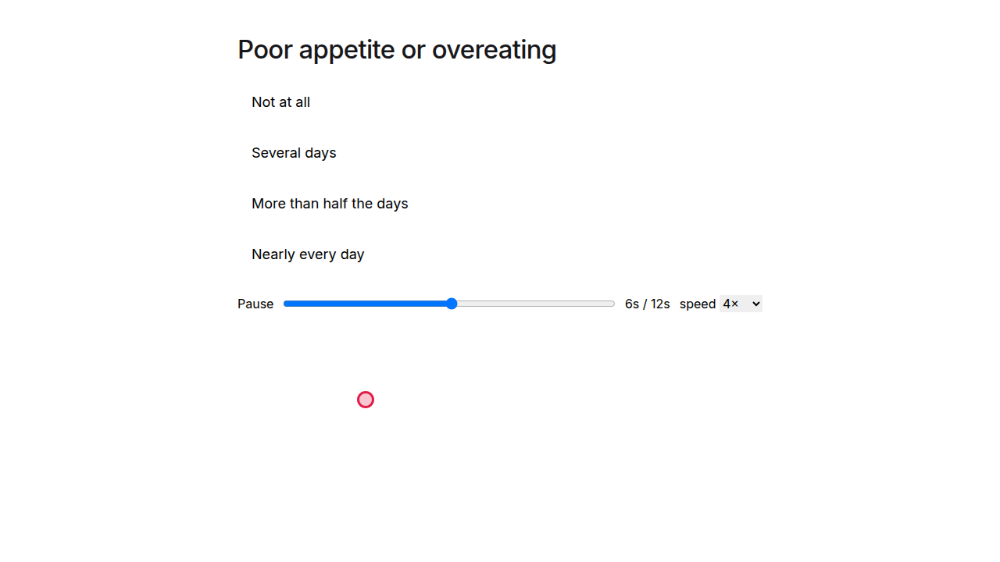

# Replay—playing back a recorded session

The player renders a read-only playback of a recorded run when launched with `?replay=<src>`. `<src>` is a
URL to a **replay bundle** `{ runtime, statements, mouse? }`. Two ways to get one:

- **File/offline (RP1).** Host a bundle yourself and point at it, e.g. a respondent-bot `trace.json`
  (`{ statements, mouse }`) paired with the questionnaire's runtime. Good for fixtures and demos.
- **VS link (RP2).** A researcher mints a short-lived, signed link to a real participant session; the
  Viewer Service assembles the bundle on demand.

## Minting a VS replay link (researcher)

```
POST /v1/deployments/{deployment_id}/sessions/{session_id}/replay-link      (researcher-gated)
  → { token, bundle_url, replay_url }
```

- `bundle_url`—`GET /v1/replay?token=…` on the Viewer Service (token-authorized, no login; the token IS
  the capability). Returns `{ runtime, statements, mouse }`.
- `replay_url`—`${WEB_VIEWER_BASE_URL}/?replay=<url-encoded bundle_url>`; present only when
  `WEB_VIEWER_BASE_URL` is set on the Viewer Service. Open it to watch the run.

## CORS—the first thing to check

The player fetches `bundle_url` **cross-origin** (player origin → Viewer Service origin). The Viewer
Service must return `Access-Control-Allow-Origin` for the player origin, i.e. the player origin must be in
`VS_CORS_ORIGINS`. If a replay shows **"Replay unavailable / could not fetch the replay source"** with a
CORS error in the console, this is almost always the cause—add the player origin to `VS_CORS_ORIGINS`
(locally and in the deployed Viewer Service env) and retry.

## Rotating the secret / revoking a link

Replay tokens are signed with `REPLAY_SIGNING_SECRET` (falls back to `INVITE_SIGNING_SECRET` when unset)—rotating
`REPLAY_SIGNING_SECRET` invalidates every replay link minted so far, VS-wide. To revoke just one session's
links without a full rotation, a researcher hits **"Revoke links"** on the `/studies` view, or calls
`POST /v1/deployments/{deployment_id}/sessions/{session_id}/replay-link/revoke` directly (researcher-gated).
After either path, `GET /v1/replay?token=` for a token minted before the revoke returns `401`; re-minting
(e.g. "Copy replay link") issues a fresh, working link. Revocation compares the token's mint time against the revoke time using the app and database clocks respectively, so if those clocks differ slightly, a link re-minted in the same instant as a revoke may take a moment to be honored.

## Known limitations (out of RP3-core scope)

- **Multi-select (checkbox) answers reconstruct from the selection stream** (forward-only). Replay folds the
  ordered `bdm:selected`/`bdm:deselected` events (each carrying `bdm:option_index`) into the checkbox state.
  Sessions recorded before this shipped lack `bdm:option_index` and replay blank.
- **Some `RadioGroup` live renderings** differ from the driven fixtures (see the respondent-bot HANDOFF);
  does not affect controlled read-only display of a reconstructed answer.

## Verifying it (automated + manual)

- **Automated:** `cd tools/respondent-bot && npm run e2e -- replay.spec.ts` drives the player to
  `/?replay=<mocked VS bundle url>` and asserts the question, the reconstructed answer, and the cursor
  overlay render (and that a non-OK bundle response shows "Replay unavailable").
- **Manual full-stack:** see the screenshot below from a real `GET /v1/replay?token=` round-trip.



*Captured 2026-07-01 from a real researcher-minted RP2 replay link—the player fetched the VS-assembled
bundle (42 statements + 196 mouse samples) and replayed it end-to-end with the cursor overlay, no player
code change.*
